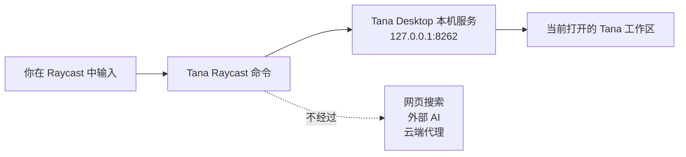
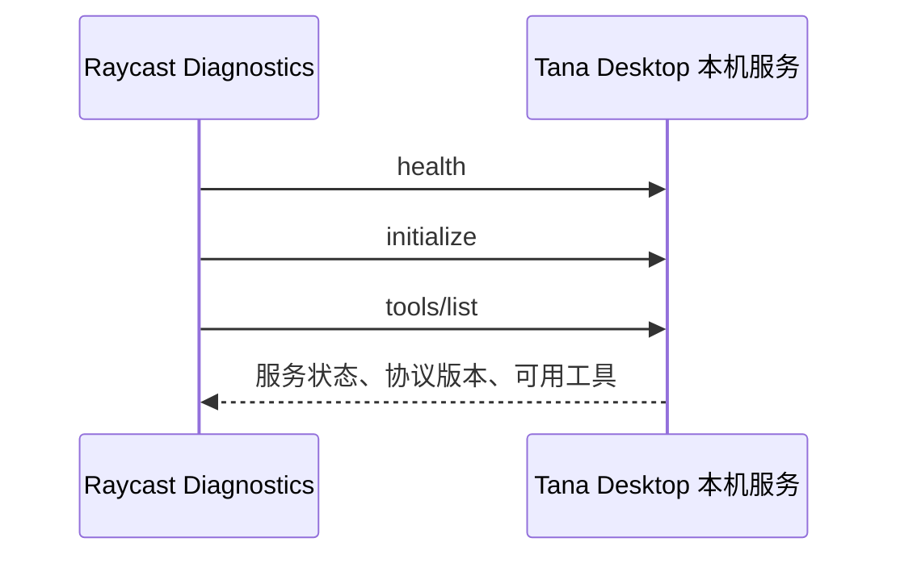
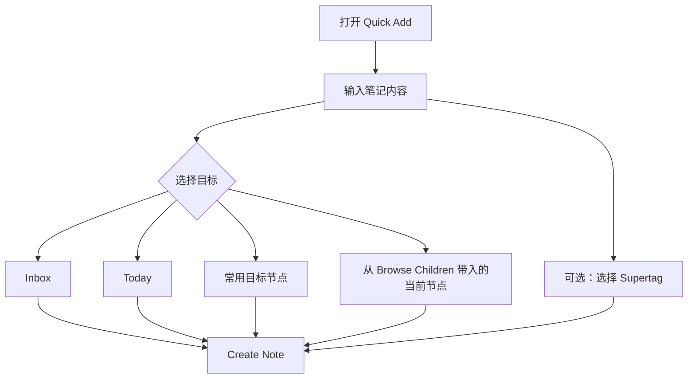
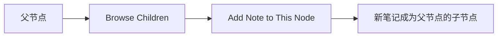

# Tana for Raycast 中文使用指南

这份文档面向普通用户：照着做即可安装、配置和使用，不需要理解 MCP 的内部协议。

这个 Raycast 插件通过 Tana Desktop 暴露在本机的 Local MCP/API 工作。默认只连接
`http://127.0.0.1:8262`，不会调用网页搜索、外部 AI、云端代理，也不会把你的 Tana
笔记内容上传到第三方服务。

## 1. 这个插件能做什么



你可以把它理解为一个“在 Raycast 里操作 Tana 的快捷入口”：

- 快速记录笔记到 Inbox、Today 或常用目标节点。
- 搜索 Tana 节点，并在 Raycast 中阅读内容。
- 浏览某个节点的子节点，并直接在该节点下新增笔记。
- 跳转打开 Tana 节点，支持当前视图、侧边面板和新标签页。
- 对节点执行勾选、取消勾选、加标签、写字段、编辑、移动、移入 Trash 等操作。
- 管理常用目标节点，方便以后快速记录。
- 查看和维护 Supertag 结构。
- 用 Diagnostics 检查 Tana 本机服务、权限和可用能力。

## 2. 安装前准备

请先确认：

1. 已安装并打开 Tana Desktop。
2. Tana 中已经打开你要使用的工作区。
3. 你有一个 Tana Personal Token。
4. Raycast 可以运行本地开发插件。

获取 Token 的路径：

```text
Tana → Settings → API Keys / API Tokens → Personal Tokens → Create Personal Token
```

安全要求：

- 不要把 Token 提交到代码仓库。
- 不要把 Token 发到聊天、Issue、截图或日志中。
- 如果 Token 已经暴露，测试结束后到 Tana 删除旧 Token，并创建一个新的。

## 3. 本地安装

进入插件目录后执行：

```bash
npm ci
npm run dev
```

Raycast 会以开发模式加载这个插件。

如果你已经安装过 Raycast Store 里的 Tana 插件，建议测试期间先禁用 Store 版本，避免两个插件命令和偏好设置混在一起。

## 4. 配置 Raycast 偏好设置

在 Raycast 中打开插件设置，填写：

| 设置项 | 是否必填 | 填写内容 |
|---|---:|---|
| Personal Token | 必填 | Tana Personal Token 原文。不要加引号，不要加 `Bearer`。 |
| Default Workspace ID | 可选 | 默认工作区 ID。留空也可以在插件界面中选择工作区。 |

配置完成后，先运行 **Diagnostics**。

理想结果：

- 本机服务可连接。
- Workspace ready。
- 能列出 MCP protocol、service version 和 tools。
- 没有缺失核心工具。



## 5. 命令总览

| 命令 | 适合什么时候用 | 主要能力 |
|---|---|---|
| Quick Add | 想快速记录一条笔记 | 写入 Inbox、Today、常用目标或当前节点；可附加 Supertag |
| Search Tana | 想查找或操作一个节点 | 搜索、阅读、浏览子节点、打开、编辑、移动、Trash |
| Today | 围绕今天的 Daily Note 工作 | 查看今日子节点、快速写入 Today、对今日节点执行动作 |
| Manage Target Nodes | 经常向固定位置记录内容 | 固定目标节点、重命名、删除、打开、执行节点动作 |
| Manage Supertags | 想查看或维护 Supertag | 查看 schema、创建 tag、添加字段、配置 checkbox |
| Diagnostics | 插件异常或需要确认环境 | 检查本机连接、权限、工具能力、工作区状态 |

## 6. 工作流一：快速记录笔记



操作步骤：

1. 在 Raycast 中运行 **Quick Add**。
2. 输入笔记内容。
3. 选择目标位置：Inbox、Today 或常用目标节点。
4. 可选：选择一个或多个 Supertag。
5. 按下 **Create Note**。

成功标志：Raycast 显示 `Note created`，Tana 中出现新节点。

## 7. 工作流二：固定常用目标节点

如果你经常把内容写到同一个项目、日志、CRM 或阅读记录节点，建议先把它固定为目标节点。

操作步骤：

1. 运行 **Manage Target Nodes**。
2. 搜索目标节点。
3. 选择 **Pin as Target Node**。
4. 根据需要给它改一个更容易识别的名字。
5. 回到 **Quick Add**，在 Target Node 中选择这个目标。

如果 Tana 刚创建的节点暂时搜不到，可以使用手动输入节点 ID 或 Tana URL 的方式固定。这样可以绕过 Tana 搜索索引延迟。

## 8. 工作流三：浏览子节点并在当前位置新增笔记

这个功能适合项目日志、阅读笔记、客户记录、任务容器等场景。

操作步骤：

1. 在 **Search Tana** 中找到一个节点，或从 **Manage Target Nodes** 打开一个固定节点。
2. 选择 **Browse Children**。
3. 在子节点列表里选择 **Add Note to This Node**。
4. 输入内容并提交。



成功标志：新笔记会被写到当前浏览的父节点下，而不是默认 Inbox。

## 9. 工作流四：从 Raycast 跳转到 Tana

在任意节点的 Action Panel 中可以选择：

| 动作 | 结果 |
|---|---|
| Open in Tana | 在 Tana 当前视图打开该节点，并尝试把 Tana 切到前台 |
| Open in Tana Panel | 在 Tana 侧边面板打开该节点 |
| Open in Tana Tab | 在 Tana 新标签页打开该节点 |

如果 Raycast 显示请求已发送，但 Tana 没有切到前台，请先手动打开一次 Tana Desktop，并确认应用路径为：

```text
/Applications/Tana Outliner.app
```

## 10. 工作流五：安全地操作节点

在节点 Action Panel 中可以执行：

- Check / Uncheck：勾选或取消勾选节点。
- Add / Remove Supertag：添加或移除 Supertag。
- Set field option：设置字段选项。
- Set field content：写入字段内容。
- Clear field：清空字段。
- Edit node：编辑节点名称和描述。
- Move node：移动节点。
- Move Node to Trash：移入 Trash。

安全边界：

- Trash 操作一定会弹出确认。
- Move 会阻止把节点移动到它自己或已知子孙节点下面。
- 结构性操作使用稳定 node ID，减少搜索索引延迟带来的误操作。

## 11. 工作流六：管理 Supertags

运行 **Manage Supertags** 可以：

1. 查看当前工作区的 Supertag。
2. 用 Markdown 阅读 Supertag schema。
3. 创建新的 Supertag。
4. 给 Supertag 添加字段。
5. 配置 checkbox 行为。

当前限制：插件暂不支持删除 Supertag，因为当前可见的 Tana 本机能力集中没有稳定的删除 Supertag 工具。

## 12. 常见问题

| 现象 | 可能原因 | 处理方式 |
|---|---|---|
| Diagnostics 连接失败 | Tana Desktop 未启动，或本机服务不可用 | 打开 Tana Desktop 后重试 |
| 认证失败 | Token 错误、过期、复制时带了多余内容，或已经暴露后被删除 | 创建新 Token，只粘贴 Token 原文 |
| Workspace not ready | Tana 当前没有打开目标工作区 | 在 Tana 中打开目标工作区 |
| 刚创建的节点搜不到 | Tana 搜索索引有延迟 | 使用固定目标节点或手动 node ID |
| Open in Tana 没有切前台 | Tana 应用未启动、路径异常或 macOS 阻止激活 | 手动打开一次 Tana 后重试 |
| Raycast 里出现两个 Tana 插件 | Store 版和本地开发版同时启用 | 测试期间禁用 Store 版 |

## 13. 新用户验收清单

你可以按下面顺序确认插件已经可用：

1. **Diagnostics** 通过。
2. **Quick Add** 能向 Inbox 创建一条测试笔记。
3. **Search Tana** 能搜到这条测试笔记。
4. **Open in Tana** 能把 Tana 切到前台并打开节点。
5. **Manage Target Nodes** 能固定一个目标节点。
6. **Browse Children** 中能看到 **Add Note to This Node**。
7. **Today** 能写入今天的 Daily Note。

以上所有能力都不需要网页搜索、外部 AI 或云端代理。
