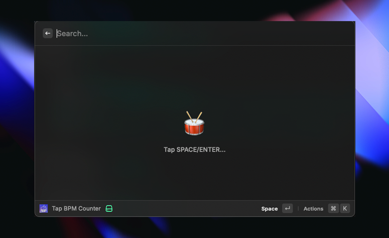
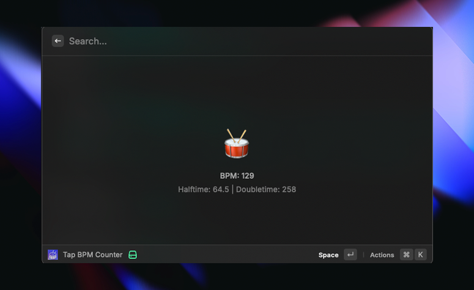

---

# BPM Counter

A simple, Tap for BPM (beats per minute) counter extension for Raycast.

## How To Use

1. Press Space or Enter in time with the music.
2. The calculated BPM will be displayed.
3. The main BPM value will be copied to your clipboard automatically after 5 seconds of no input, then reset.

## Future Features

- A menu bar integration.
