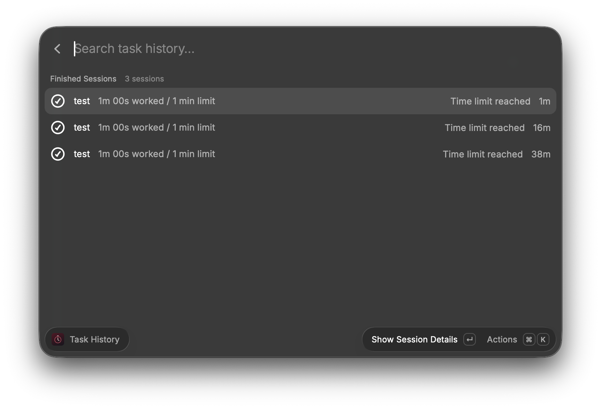
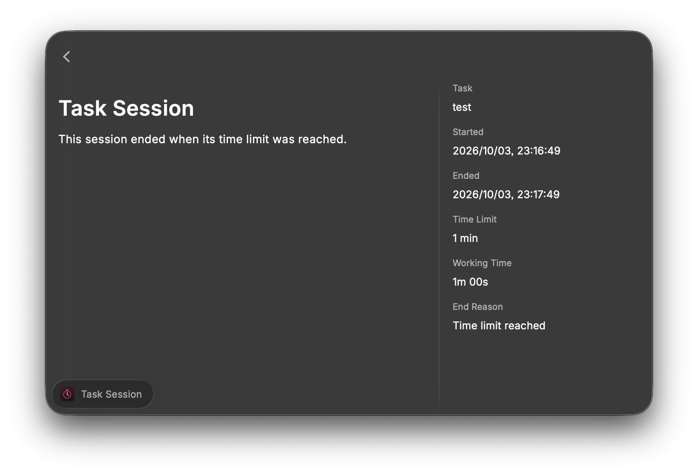
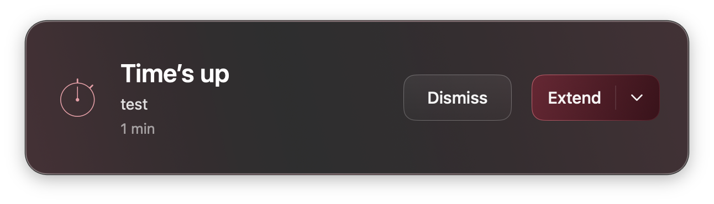

# Task

Start a timed task directly from Raycast's root search.

Requires macOS 14 or newer. The bundled native helper supports Apple Silicon.
On Intel Macs, Xcode Command Line Tools are required to compile the helper;
Intel execution has not been verified.

## Development

Run `npm install`, then `npm run dev`. In Raycast, search for and select **task**,
enter the task name in **Task**, use Tab to move to **Minutes**, enter a
positive whole number, and press Enter. No form view is opened.

The **task** command starts the task and automatically launches
the bundled macOS menu-bar helper, with no separate display command to run.
Raycast labels this command as **Command** in search results.
The task command can also be given a dedicated hotkey in Raycast settings.

Click the menu-bar timer to see the full task name, remaining time, status,
and duration. Opening the menu does not start another task. While the menu
is open, its countdown continues to refresh every second. Select **Pause**
to freeze the remaining time, **Resume** to continue, or **End Task** to end immediately.
Manual end frees the session so a new task can be started right away.

Only one task can run at a time. Empty task names and invalid minutes do not
start a timer. Completed tasks disappear from the menu bar automatically,
and a new task can then start.

## Timer refresh

The deadline is saved as an absolute timestamp, so closing Raycast's search
window or sleeping the Mac does not reset the countdown. Completion is
determined from the deadline whenever the state is read.

The native helper updates the display every second. At the deadline it removes
the menu-bar item, plays a quiet sound, and shows a compact **Crimson Glass**
completion panel at the upper-right of the screen. The panel uses a smoked-glass
background with deep red accents and shows only the task name and working time.
It does not activate the app, steal keyboard focus, or block other work.
Choose **Dismiss** to close it, or **Extend** and select **5 min**, **10 min**, or
**15 min** to restart the same task name with a new countdown in the menu bar.
The panel stays available until dismissed or extended. An old notification
cannot replace a task that has since started. Manual end removes the item
immediately without a completion notification.
It runs independently of Raycast's search window.
No background-refresh setting is needed. After system sleep, the next update
uses the current time and removes expired tasks.

A compiled helper is bundled for this Mac's CPU architecture. On other
architectures, the first run compiles the bundled Swift source locally using
Xcode Command Line Tools and reuses it thereafter. No external service is
contacted. The helper does not launch at login; run task again to restore a
still-running session after restarting macOS.

## History

Run **Task History** in Raycast to search finished sessions, newest first.
Press Enter on a session to see its task name, start/end timestamps, time limit,
working time (excluding pauses), and end reason (**Time limit reached** or
**Ended manually**). Press Command R to refresh while the list is open.

New sessions are recorded automatically at completion or manual end. Pausing,
resuming, and reopening a timer do not add duplicate records. History is stored
locally in `task-history.json` in the extension's support directory, without
external communication. Sessions finished before this feature was added are
not imported because their actual working time and end reason were not recorded.

Each extension is recorded as a separate session with the same task name and
its own time limit. The original completed session remains in history.

## Screenshots

