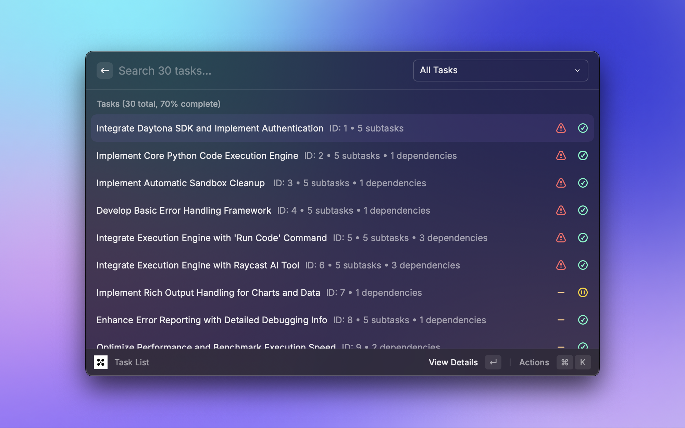

# TaskMaster Raycast Extension

Visual task management for TaskMaster AI projects directly in Raycast.



## About TaskMaster AI

[TaskMaster AI](https://github.com/eyaltoledano/claude-task-master) is an intelligent task management system that uses AI to help break down complex projects into manageable tasks with automatic dependency tracking, complexity analysis, and smart task recommendations.

## Features

- **Kanban Board**: Visual task organization by status
- **Task List**: Chronological view with filtering and sorting  
- **Search Tasks**: Full-text search across all tasks
- **Next Task**: Smart recommendations based on dependencies
- **Project Status**: Comprehensive dashboard with progress insights
- **Add Task**: Create new tasks with form validation
- **AI Assistant**: Built-in tools for project analysis and task complexity reporting

## Quick Start

1. **Install TaskMaster AI**: `npm install -g task-master-ai`
2. **Initialize project**: `task-master init` in your project directory
3. **Configure Raycast**: Set project root path in extension preferences
4. **Start managing**: `⌘ + Space` → type "kanban", "task list", etc.

## Requirements

- [TaskMaster AI CLI](https://github.com/eyaltoledano/claude-task-master) installed
- TaskMaster project with `.taskmaster/tasks/tasks.json` file

## Development

```bash
npm run dev        # Development mode
npm run build      # Build extension
npm run lint       # Code quality checks
```