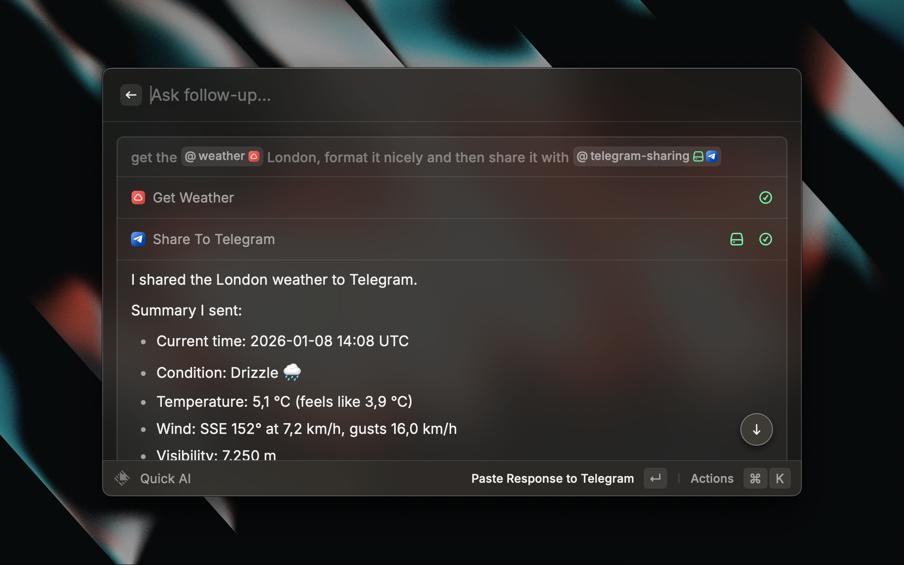

# Telegram sharing

Shares browser page or copied text to Telegram.

## Settings

Available Settings:

- [ ] **Use Browser Extension**: when enabled, it uses the Raycast Browser Extension to get the current page URL. When disabled, falls back to AppleScript. Default behaviour: enabled.

## AI Extension

Ask @telegram-sharing to share the outcome of your AI task with Telegram. At the end of the task it will open Telegram with the content ready to be sent.

