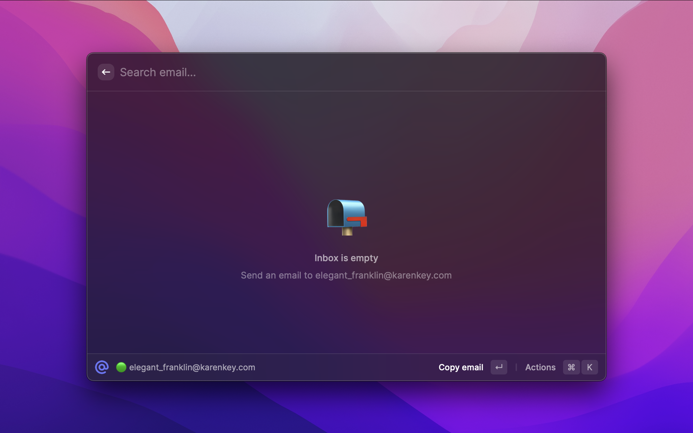
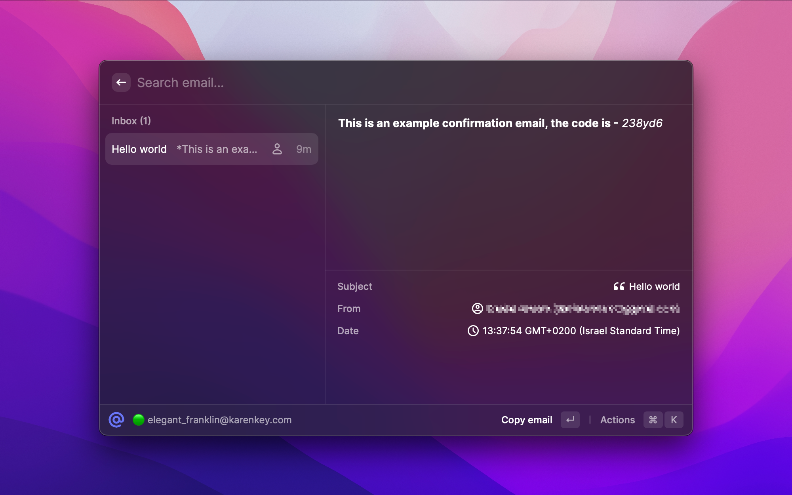

  
  <h1 align="center">Temp Mail</h1>

A [Raycast](https://raycast.com/) extenstion that lets you easily create a disposable temporary email inbox via [Mail.tm](https://mail.tm/).

This extension is made by [Daniel Amram](https://github.com/danielamram) and uses [Temp Mail API](https://docs.mail.tm/) (Mail.tm) - no API key required

