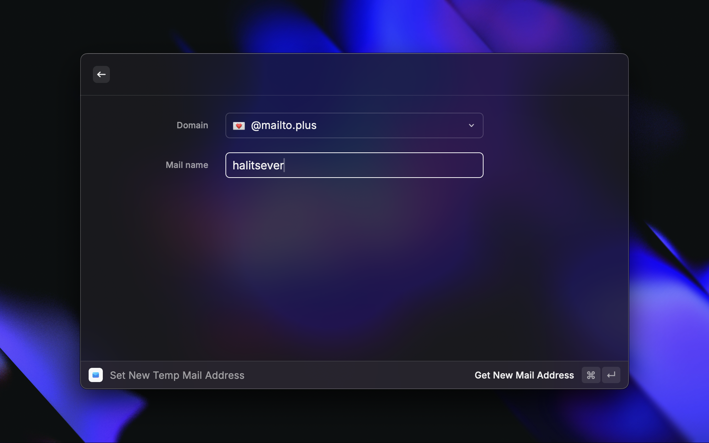
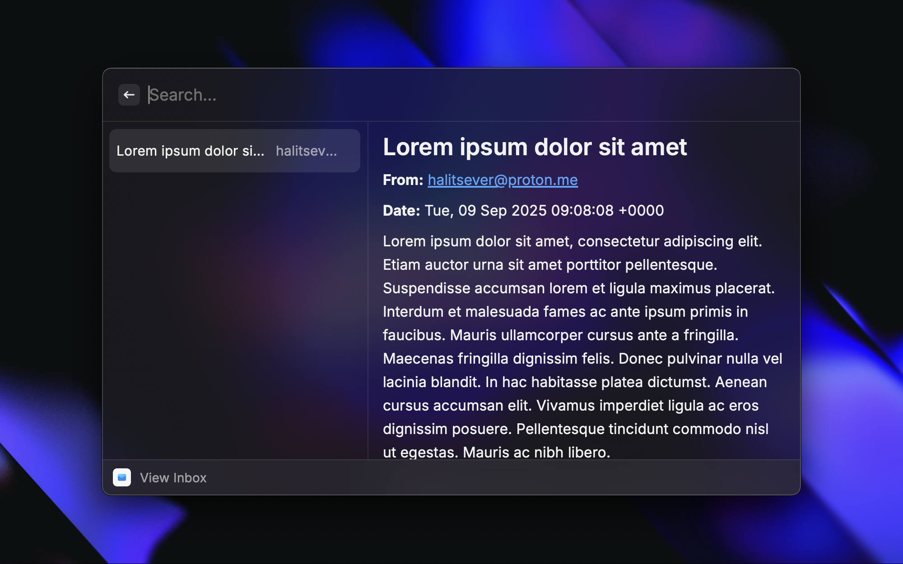

 

💌 Raycast extension for read & create temp mail addresses via 
<a href="https://github.com/halitsever/temp-mail-plus-api/">Temp Mail Plus API</a> 
 
 

- Set new mail with "Set mail" command

- Read inbox with "Read Inbox" command

 

You can install on <a href="https://www.raycast.com/store">Raycast Store</a>

  MIT LICENSE | Halit Sever

