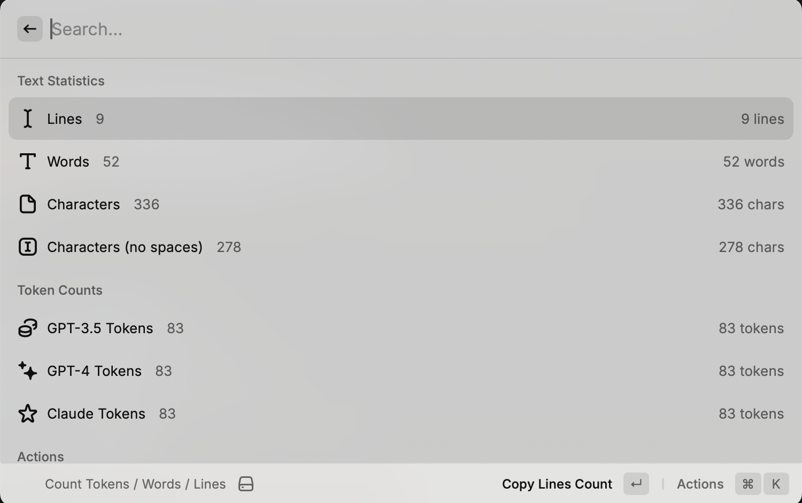

# Text Counter for Raycast

A Raycast extension that instantly counts words, characters, lines, sentences, paragraphs, reading time, and LLM tokens from your selected text or clipboard — with proper support for Chinese, Japanese, and Korean.



## Features

- **Words**: space-delimited words plus CJK characters (the same convention as Word/Pages), so mixed Chinese/English text is counted correctly
- **Characters**: grapheme-accurate (an emoji like 👨‍👩‍👧 counts as 1), with and without spaces
- **Lines / Sentences / Paragraphs**: sentence detection understands both `.!?` and `。！？…`
- **Reading Time**: ~200 words/min for space-delimited scripts, ~300 chars/min for CJK
- **Token Counts**:
  - `o200k_base` (GPT-4o, o-series) — exact
  - `cl100k_base` (GPT-4, GPT-3.5-turbo) — exact
  - Claude — estimate (Claude 3+ tokenizers are not public)
- **Context Window Usage**: see what percentage of a model's context your text occupies
- **Cost Estimates**: input cost per model, using live pricing from [models.dev](https://models.dev) (cached for 24 hours; hidden gracefully when offline)

## Usage

1. Select text in any app (or copy it to the clipboard)
2. Open Raycast and run "Count Tokens / Words / Lines"
3. View the statistics instantly — the top row shows a preview of the analyzed text and its source
4. Press ⏎ on any statistic to copy it, or ⌘R to refresh

## Actions

- **Copy Individual Counts**: press ⏎ on any statistic
- **Copy All Statistics**: as plain text, Markdown table, or JSON
- **Refresh** (⌘R): re-read from selection/clipboard

## Preferences

- Prefer selected text over clipboard (on by default)
- Show/hide token counts, reading time, and cost estimates

## Privacy

All counting happens locally — your text never leaves your device. The only network request is an optional daily fetch of public model pricing from models.dev (no text or telemetry is sent).

## Development

```bash
npm install      # Install dependencies
npm run dev      # Run in development mode
npm run build    # Build for production
npm run test     # Run unit tests
npm run lint     # Lint code
```

Requires Node.js 20+ and the Raycast app.

## License

MIT

## Author

Fernando Jacob ([@MatrixA](https://github.com/MatrixA)) — [github.com/MatrixA/counter-raycast](https://github.com/MatrixA/counter-raycast)
