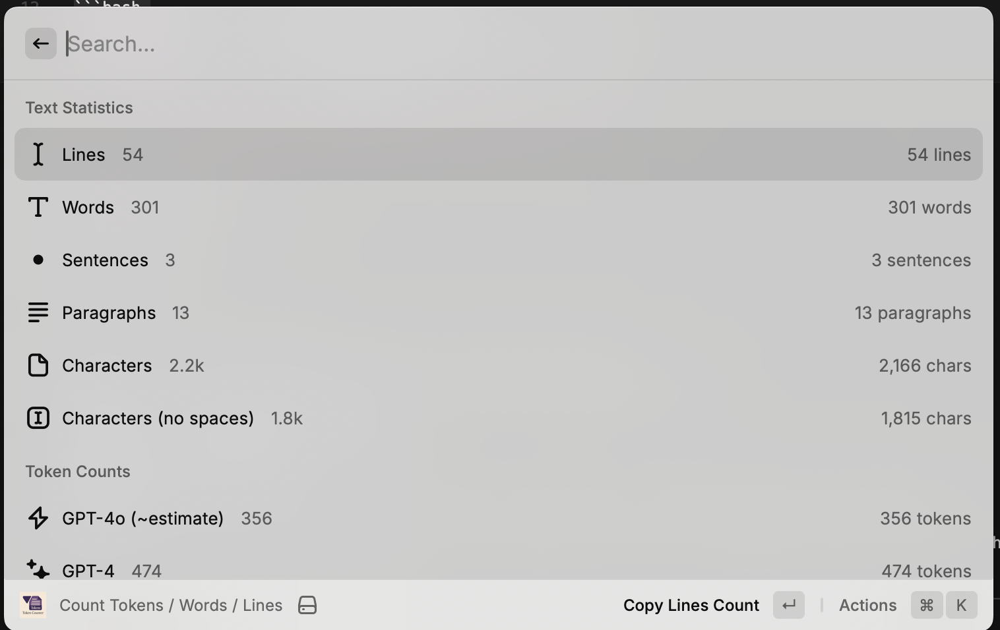

# Counter for Raycast

A powerful Raycast extension to quickly count lines, words, characters, and tokens from your clipboard content.



## Features

- **Lines Count**: Count the number of lines in the text
- **Words Count**: Count the number of words
- **Sentences Count**: Count the number of sentences
- **Paragraphs Count**: Count the number of paragraphs
- **Characters Count**: Count total characters including spaces
- **Characters (no spaces)**: Count characters excluding spaces
- **Token Counts**: Support for multiple AI models:
  - GPT-4o tokens (~estimated)
  - GPT-4 tokens
  - GPT-3.5-turbo tokens
  - Claude tokens

## Usage

1. Copy any text to your clipboard
2. Open Raycast (⌘ + Space by default)
3. Search for "Count Tokens / Words / Lines"
4. View the statistics instantly
5. Click on any statistic to copy it to clipboard
6. Use ⌘+R to refresh from clipboard

## Actions

- **Copy Individual Counts**: Click on any statistic to copy just that value
- **Copy All Statistics**: Copy a formatted summary of all counts
- **Refresh**: Update counts with new clipboard content (⌘+R)

## Installation

### From Raycast Store
Coming soon!

### Manual Installation
1. Clone this repository
2. Run `npm install`
3. Run `npm run dev` to test locally
4. Run `npm run build` to build the extension

## Permissions
- **Clipboard**: Required to read text from clipboard

All processing happens locally - your text never leaves your device.

## Development

```bash
# Install dependencies
npm install

# Run in development mode
npm run dev

# Build for production
npm run build

# Lint code
npm run lint
```

## Requirements

- Node.js 18+
- Raycast app

## License

MIT

## Author

MatrixA

## Repository

[https://github.com/MatrixA/counter-raycast](https://github.com/MatrixA/counter-raycast)