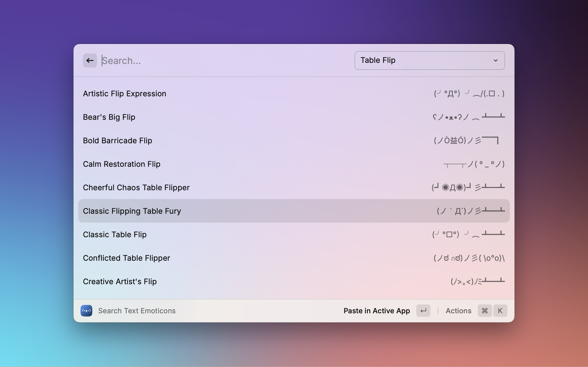

  

    
  

  <h1>
    <strong>Raycast Text Emoticons</strong>
  </h1>

  

      <a href="https://www.raycast.com/">Raycast</a> extension to find and use Text Emoticons, like <abbr title="Shrug">¯\_(ツ)_/¯</abbr>, <abbr title="Flipping table">(╯°□°）╯︵ ┻━┻ </abbr>, and <abbr title="Lenny face">( ͡° ͜ʖ ͡°)</abbr>
  

  

    
    
  

  

    
  

## Features

- Let's you find and choose from 3363 emoticons
- Find a random emoticon and paste it into the current application 
- Remembers the related emoticons you've chosen before (you can configure the number of items in the extension settings)

## Credits

Based on the https://glyphy.io/emoticons

<h3 align="center">ʕ•ᴥ•ʔﾉ♡</h3>