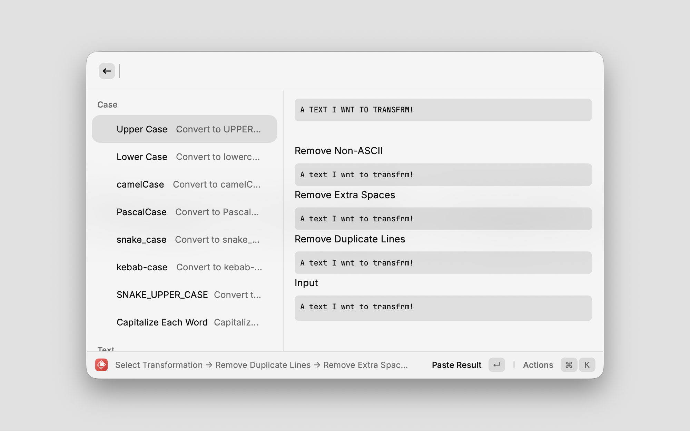

# Text Toolbox

Transform text with 27+ operations including case conversions, encoding/decoding, hashing, and line operations. Chain multiple transformations for powerful text processing.



## Features

- **Interactive transformation list** with live preview and search
- **Chain transformations** - apply multiple operations sequentially
- **Quick transform commands** - instant transformations via keyboard shortcuts
- **27 transformations** across 5 categories

### All Transformations

#### Case Conversions (8)
- **UPPERCASE** - Convert all characters to uppercase
- **lowercase** - Convert all characters to lowercase
- **camelCase** - Convert to camelCase (first word lowercase, rest capitalized)
- **PascalCase** - Convert to PascalCase (all words capitalized, no spaces)
- **snake_case** - Convert to snake_case (words separated by underscores)
- **kebab-case** - Convert to kebab-case (words separated by hyphens)
- **SNAKE_UPPER_CASE** - Convert to SNAKE_UPPER_CASE (constant case)
- **Capitalize Each Word** - Capitalize the first letter of each word

#### Text Operations (3)
- **Trim** - Remove leading and trailing whitespace
- **Remove Extra Spaces** - Collapse multiple spaces into single spaces
- **Remove Non-ASCII** - Remove all non-ASCII characters

#### Line Operations (4)
- **Sort Lines** - Sort lines alphabetically
- **Reverse Lines** - Reverse the order of lines
- **Remove Duplicate Lines** - Remove duplicate lines while preserving order
- **Add Line Numbers** - Prepend line numbers to each line

#### Encoding/Decoding (8)
- **URL Encode** - Encode text for use in URLs (percent encoding)
- **URL Decode** - Decode URL-encoded text
- **Base64 Encode** - Encode text to Base64
- **Base64 Decode** - Decode Base64 text
- **HTML Encode** - Encode HTML entities (&lt;, &gt;, &amp;, etc.)
- **HTML Decode** - Decode HTML entities
- **Hex Encode** - Encode text to hexadecimal
- **Hex Decode** - Decode hexadecimal text

#### Hashing (4)
- **MD5** - Generate MD5 hash
- **SHA1** - Generate SHA1 hash
- **SHA256** - Generate SHA256 hash
- **SHA512** - Generate SHA512 hash

## Usage

### Method 1: Transform Selected Text (Recommended)
1. Select text in any application
2. Open Raycast (⌘+Space)
3. Type "Transform Selected Text"
4. Choose transformation from the list
5. Press Enter to apply

The transformed text replaces your selection instantly.

### Method 2: Transform with Input
1. Open Raycast (⌘+Space)
2. Type "Transform Text Input"
3. Enter or paste your text
4. Choose transformation from the list
5. Press Enter to apply

### Method 3: Quick Transform Commands (Advanced)
For frequently-used transformations, set up keyboard shortcuts:

1. Open Raycast Settings → Extensions → Text Toolbox
2. Enable individual transformation commands (disabled by default)
3. Assign keyboard shortcuts to your favorite transformations
4. Select text and press your shortcut for instant transformation

### Chaining Transformations
Apply multiple transformations in sequence:

1. Transform text using Method 1 or 2
2. In the transformation list, press Enter to apply
3. The result stays in the list - choose another transformation
4. Repeat to build complex text processing pipelines

**Example:** Convert "Hello World" → lowercase → URL encode → Base64 encode

## Configuration

### Text Source (Quick Commands)
Configure where quick commands get text from:
- **Selected Text Only** - Only use selected text, fail if none
- **Prefer Selected Text** - Use selected text, fall back to clipboard
- **Clipboard Only** - Only use clipboard contents
- **Prefer Clipboard** - Use clipboard, fall back to selected text

### Result Behavior (Quick Commands)
Choose what happens with transformed text:
- **Copy to Clipboard** - Copy result without pasting
- **Paste to Active App** - Replace selection/paste at cursor

### Transformation Visibility
Show/hide individual transformations in the interactive list. All transformations are visible by default. Disable rarely-used ones to streamline your workflow.

## Examples

### Case Conversion
```
Input:  "hello world"
Output: "Hello World" (Capitalize Each Word)
Output: "helloWorld" (camelCase)
Output: "hello-world" (kebab-case)
```

### Text Cleaning
```
Input:  "  hello   world  "
Output: "hello   world" (Trim)
Output: "hello world" (Remove Extra Spaces)
```

### Encoding/Hashing
```
Input:  "hello@example.com"
Output: "hello%40example.com" (URL Encode)
Output: "aGVsbG9AZXhhbXBsZS5jb20=" (Base64 Encode)
Output: "5d41402abc4b2a76b9719d911017c592" (MD5)
```

### Line Operations
```
Input:  "line3\nline1\nline2\nline1"
Output: "line1\nline2\nline3" (Sort Lines)
Output: "line3\nline1\nline2" (Remove Duplicate Lines)
```