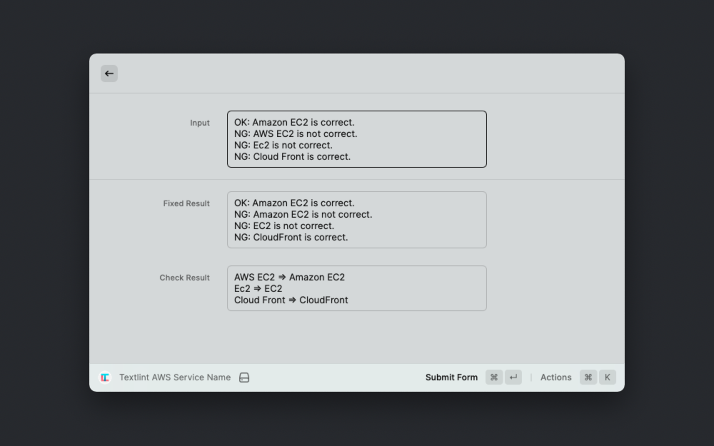

# textlint-rule-aws-service-name

Checks that the text does not contain typos in the AWS service name.
Correct the service name at the same time.

  

## Features

- You can correct and verify the typo in the AWS service name
- For example
    - AWS EC2 => Amazon EC2
    - Cloud Front => CloudFront
    - Amazon Security Hub => AWS Security Hub

## Usage

Plese input your text into textarea.

Submitting the form will display the text check items and the modified text.

## Showcases

