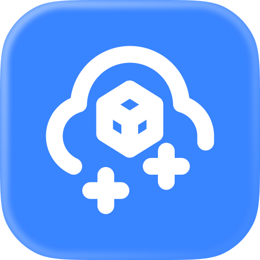

    

# The Blue Cloud

This is the **unofficial** Raycast Extension for [Dropbox](https://dropbox.com) allowing you to List Files, Search Files, Download Files, and more.

By default, the Extension uses OAuth. However, if you prefer to use your own access token e.g. if OAuth is not working, follow the steps in the next section:

## How to get access_token

1. `Navigate` to [App Console](https://www.dropbox.com/developers/apps)
2. `Click` "Create app"
3. `Enter` details:
    - Choose an API: **Scoped access**
    - Choose the type of access you need: **Full Dropbox– Access to all files and folders in a user's Dropbox.**
    - Name your app: **UNIQUE_NAME_OF_YOUR_CHOICE**
4. `Click` "Create app" again
5. `Click` "Scoped App" in "Permission Type"
6. `Tick` the following permissions:
    - account_info.read
    - files.metadata.read
    - files.content.read
7. `Click` "Submit"
8. Go back to Settings of the App
9. Click `Generate` under "Generated access token"
10. `Copy` token
11. `Open` Extension Prefernces of the Dropbox Raycast Extension
12. `Enter` this token in Preferences

## 📥 Downlaoading

In order to download files from the convenience of Raycast, set a "Download Directory" in `Preferences` (if it is not set, you will be asked to set one when downloding for first time)

> TIP: Make sure Raycast has permission to access the directory you choose

When downloading, you may need to re-authorize your Dropbox login in order to have the required permissions (not to worry, you will be prompted to do so)!