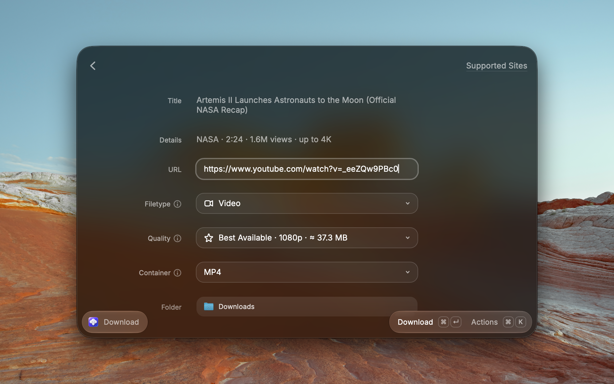

# The Downloader

Download videos, audio, image galleries, Spotify music, and complete webpages from the web — straight from Raycast. Then chat with AI about any video, post or article.



The Downloader started as a fork of [Video Downloader](https://www.raycast.com/vimtor/video-downloader) by vimtor and its contributors — thank you.

## Commands

- **Download** — paste a URL, choose what to grab (video, audio, image, transcript, or webpage) and the quality, then download. A live view follows the download: a progress ring, speed, time left and size, a download-speed chart, and the steps (prepare → video → audio → merge → saved), with the title, channel, format and folder alongside. Press Esc to go back to the form; the download keeps running and its toast keeps reporting progress.
- **Fast Download** — pass a URL as a command argument and download it instantly using your saved defaults — no form.
- **Download History** — everything you've downloaded, grouped by day, with thumbnails, search, type filters, and one-keystroke Open, Show in Finder and Download Again.
- **Chat About Link** — paste a link and ask anything about it: a video (YouTube, TikTok, X, Vimeo…), a social post (Instagram, Reddit, Pinterest…) or any article. The Downloader loads its details and statistics and its text — a video's transcript with timestamps, a post's caption, an article's text — then answers, with clickable timestamps for videos. Suggested questions fit each kind of link. Chats are saved, so you can continue them later. Also available from the Download form, the preview, the live view and the history (⌘⇧A). Articles are read without ever touching your local network (routers, `.local` and private addresses are refused), and in the page's own text encoding. When a page blocks apps, is gone or needs JavaScript, you can read the Internet Archive's saved copy instead (not for pages behind a login, a paywall or a legal block).

Before downloading, the form shows what yt-dlp found — channel, duration, views and the best quality — and each Quality choice lists the resolution and estimated size it will fetch. Press ⌘Y for a full preview with the description and every available format.

## AI

Chat About Link works with the model you pick in its own preferences (**AI Engine**, under Chat About Link in Raycast Settings):

- **Raycast AI** — needs Raycast Pro. Choose a model under **Raycast AI Model**.
- **Apple Intelligence** — free, on macOS 27 with Apple Intelligence turned on, through the built-in `fm` tool, on-device. Accept its terms once with `sudo fm license` in Terminal.
- **Ollama** — free and local. Set the model and context size in preferences.

Chat About Link's settings also set the **Answer Style** (Balanced, Short with a TL;DR first, or Detailed), the **Answer Language** (the question's own, or a fixed language) and **Custom Instructions** added to every answer.

**Automatic** uses Raycast AI when you have it, then Apple Intelligence, then a running Ollama. You can also switch engines from the dropdown in the chat. When a transcript or article is longer than the model's context, Chat About Link sends the passages that match the question, and reads summaries part by part so nothing is skipped.

In Raycast AI Chat, mention **@the-downloader** to download videos, read any link (`read-link`: a video's timestamped transcript, a post's caption or an article) or get its details and statistics (`get-link-info`). The extension also includes three Skills: **Summarize Link**, **Study Notes** and **Performance Check**.

Privacy: when `read-link` or `get-link-info` can't read an article (it blocks apps, is gone or needs JavaScript), they look up its saved copy on the Internet Archive automatically, which sends the link to archive.org. In Chat About Link that only happens when you choose **Read Archived Copy**.

## What you need

The Downloader drives a few command-line tools:

- **yt-dlp** — videos and audio
- **Deno** — JavaScript runtime yt-dlp uses for YouTube extraction
- **ffmpeg** (with **ffprobe**) — audio extraction and format conversion
- **gallery-dl** — image galleries
- **spotDL** — Spotify tracks, albums, and playlists
- **monolith** — complete webpages saved as a single HTML file

The extension installs any that are missing for you on first use. yt-dlp, ffmpeg, gallery-dl, Deno, and monolith install via Homebrew on macOS:

```bash
brew install yt-dlp ffmpeg gallery-dl deno monolith
```

spotDL isn't installed with the others: the first time you use the Spotify feature, the extension downloads its prebuilt binary from [spotDL's official GitHub Releases](https://github.com/spotDL/spotify-downloader/releases) over HTTPS, checks it against the SHA-256 published with the release, and ad-hoc codesigns it on macOS. The prebuilt binary is x86_64-only, so Apple Silicon Macs need Rosetta 2 (`softwareupdate --install-rosetta --agree-to-license`); alternatively, install spotDL via `brew install spotdl` for a native Apple-Silicon Python build.

## Supported sites

See [SUPPORTED_SITES.md](SUPPORTED_SITES.md).

## Login-gated galleries

To download from sites that require a login, point the extension at a browser you're already signed into. See [BROWSER_COOKIES.md](BROWSER_COOKIES.md).

## Spotify downloads

Spotify links need a one-time Developer app setup so spotDL can fetch track metadata. See [SPOTIFY.md](SPOTIFY.md).
