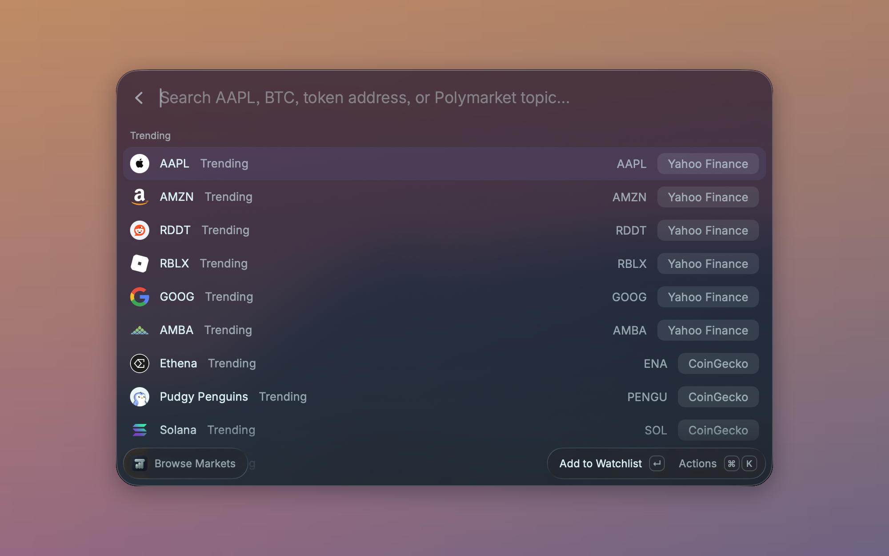
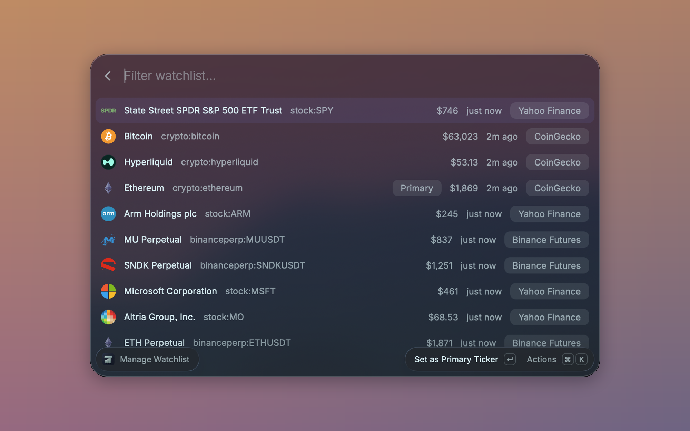
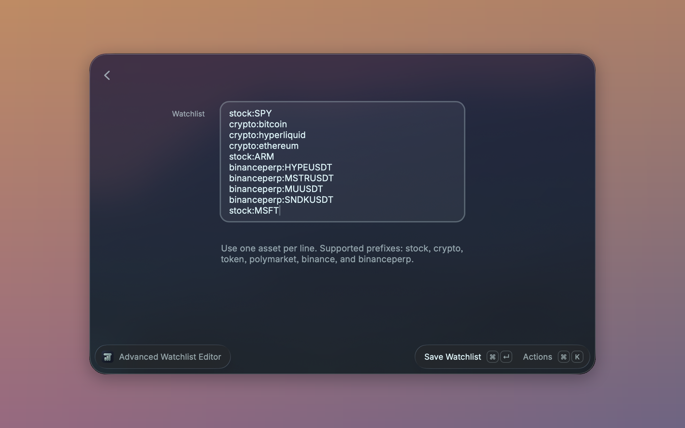
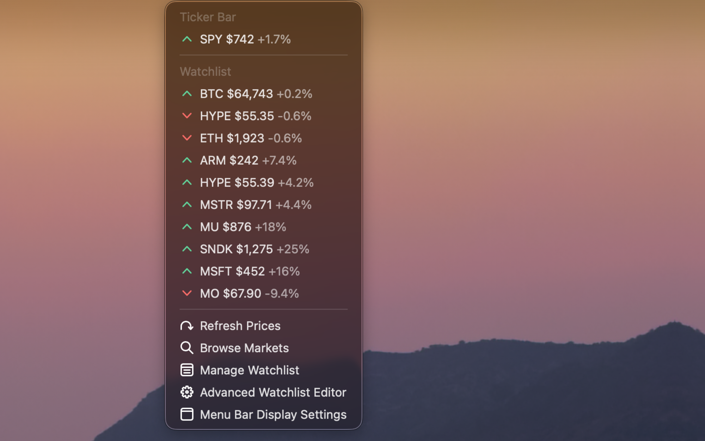

# Ticker Bar

Track the markets you care about from the macOS menu bar. Ticker Bar combines stocks, crypto, exchange pairs, perpetual futures, on-chain tokens, and prediction markets in one fast, keyboard-first watchlist.

## Preview

| Browse markets                                                                                 | Manage your watchlist                                                           |
| ---------------------------------------------------------------------------------------------- | ------------------------------------------------------------------------------- |
|  |  |

| Advanced editor                                                               | Menu bar                                                                    |
| ----------------------------------------------------------------------------- | --------------------------------------------------------------------------- |
|  |  |

## Highlights

- **Always visible** — show the primary price or include its daily change, with an optional market logo beside the menu-bar title.
- **Six market types** — stocks, CoinGecko crypto, Binance Spot, Binance perpetual futures, DEX tokens, and Polymarket outcomes.
- **Cache-first and resilient** — cached prices appear immediately; freshness, provider failures, and stale data are shown explicitly.
- **Built for rate limits** — requests are timed out, batched where providers support it, and cooled down after throttling.
- **Keyboard-first management** — search, add, inspect, reorder, make primary, refresh, and remove without leaving Raycast.
- **Detailed quotes** — inspect daily change, open, high, low, volume, market cap, funding, market state, provider, and update time when available.

## Commands

| Command                       | Purpose                                                          |
| ----------------------------- | ---------------------------------------------------------------- |
| **Ticker Bar**                | Show the live menu bar item and watchlist dropdown.              |
| **Browse Markets**            | Search every supported market type and add results.              |
| **Manage Watchlist**          | Inspect, reorder, refresh, remove, or choose the primary asset.  |
| **Advanced Watchlist Editor** | Bulk edit exact asset IDs, with validation and a 50-asset limit. |
| **Update Market Data**        | Fetch fresh quotes and update the current watchlist cache.       |

### Keyboard shortcuts

- `↩` runs the primary action.
- `⌘ D` opens market details.
- `⌘ ↑` / `⌘ ↓` reorders an asset.
- `⌃ X` removes an asset.

## Preferences

**Menu Bar Style** — choose a style from the **Menu Bar** submenu in Ticker Bar:

- `Primary Ticker`
- `Primary Ticker and Change`

**Menu Bar Logo** — toggle `Logo: On / Off` inside the **Menu Bar** style submenu. When enabled, real provider artwork appears beside the macOS menu-bar title. Dropdown rows retain their colored direction chevrons; logos also appear in Browse Markets, Manage Watchlist, and market details.

### Currency

USD, CAD, EUR, or GBP for CoinGecko crypto quotes. Stocks, exchange pairs, futures, DEX tokens, and prediction markets remain in their provider-native USD or quote-currency representation.

## Advanced asset IDs

Enter one asset per line. Blank lines and comments beginning with `#` are ignored.

```text
stock:AAPL
crypto:bitcoin
binance:BTCUSDT
binanceperp:BTCUSDT
token:base:0x4200000000000000000000000000000000000006
polymarket:540817:yes
```

Bare stock symbols such as `SPY` and bare EVM contract addresses are normalized automatically. Invalid entries are reported instead of being silently discarded.

## Data behavior

Ticker Bar stores the watchlist and quote cache locally through Raycast. It sends only the identifiers needed for quote and search requests to the selected public data providers; no account or API key is required. Those providers may rate-limit heavy watchlists. A failed refresh never replaces the last valid quote; instead, the cached quote is marked stale with the provider error and last successful update time.

Provider-specific cache windows range from one to five minutes. Manual refresh bypasses those windows, while rate-limit cooldowns are still respected to avoid repeatedly hammering a throttled service.

## Data sources

- Stocks: [Yahoo Finance](https://finance.yahoo.com)
- Stock and ETF logos: [Financial Modeling Prep](https://site.financialmodelingprep.com/)
- Crypto: [CoinGecko](https://www.coingecko.com)
- Binance Spot: [Binance public market-data API](https://developers.binance.com/docs/binance-spot-api-docs/rest-api/general-api-information)
- Binance perpetual futures: [Binance USDⓈ-M Futures](https://developers.binance.com/docs/derivatives/usds-margined-futures/general-info)
- On-chain tokens: [DEX Screener](https://dexscreener.com)
- Prediction markets: [Polymarket Gamma API](https://docs.polymarket.com)

Availability and fields vary by provider and market. Ticker Bar labels the provider on every quote.

## Development

```bash
npm install
npm test
npm run lint
npm run build
```

The tests cover asset-ID normalization, display formatting, freshness
filtering, failure states, request batching, and Polymarket outcome math.

### Architecture

Command views import from `src/market.ts`, a stable public façade. The
implementation is split by responsibility:

- `market-storage.ts` owns watchlist, primary-asset, quote, and status
  persistence.
- `market-refresh.ts` owns freshness windows, concurrency, cooldowns, and the
  cross-command refresh lock.
- `providers/` contains one adapter per external data source plus the quote and
  search dispatcher.
- `market-ids.ts`, `market-format.ts`, and `market-types.ts` contain pure
  domain logic shared by commands and providers.

Keep provider-specific response types and normalization inside their adapter.
New commands should use the `market.ts` façade rather than importing provider
modules directly.

### Repository layout

```text
assets/       Public extension icon
media/        Images linked from the public README
metadata/     Raycast Store screenshots
src/          Commands, domain modules, and provider adapters
tests/        Pure logic and resilience tests
```

Before opening a contribution, run:

```bash
npm test
npm run lint
npm run build
```

## Troubleshooting

- **A quote shows a warning:** open Market Details to see the last successful update and provider error, then run Update Market Data after the cooldown.
- **A symbol is not found:** search in Browse Markets first. The advanced editor accepts exact provider identifiers, not fuzzy names.
- **A DEX token resolves incorrectly:** use the chain-qualified form, such as `token:base:0x…`.
- **The menu title is empty:** choose a text-based Menu Bar Style and set a primary asset in Manage Watchlist.
