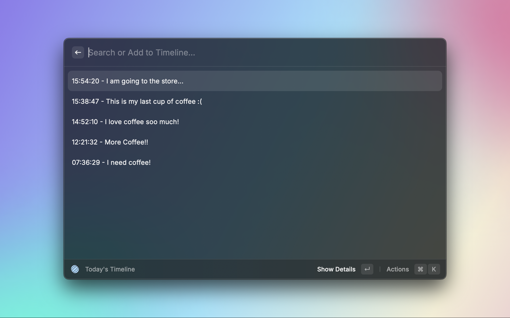
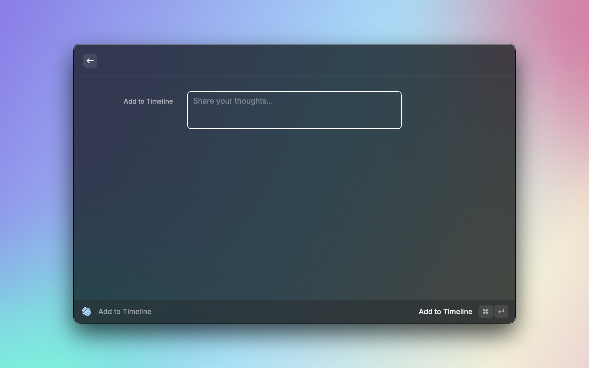

# Raycast Timeline Journal

Put your thoughts on a timeline.

### Daily Timeline

### Add to Timeline (Longform)

### Search Your Previous Timelines

## Setup
Provide a folder path to store all your timelines in markdown format. Then start journaling!

Adjust additional settings such as insert position, date, and time format, go to: `Raycast Settings > Extensions > Timeline Journal`.
