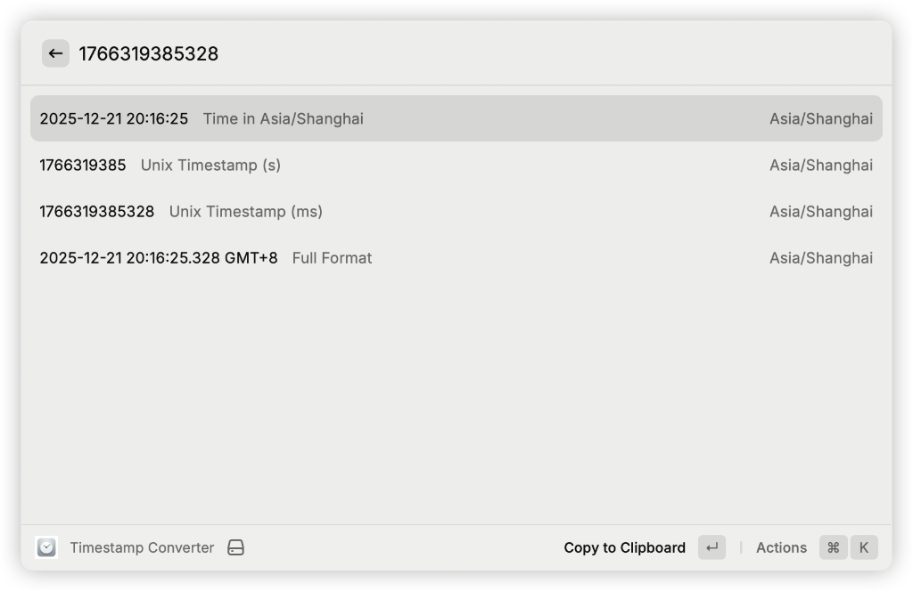
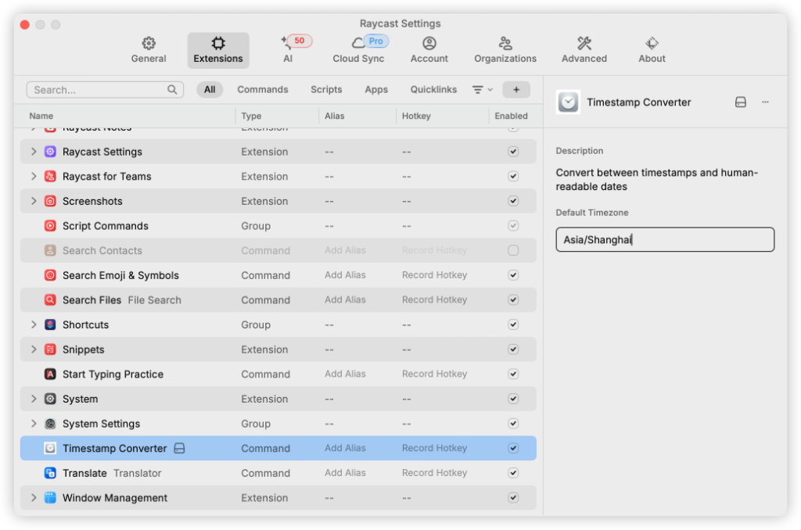

# Timestamp Converter for Raycast

This is a Raycast extension that allows you to quickly convert between Unix timestamps and human-readable dates with timezone support.

## Features

- **Instant Conversion**: Type a timestamp or a date string, and see the results update instantly.
- **Smart Detection**: Automatically detects:
    - Unix Timestamps (Seconds & Milliseconds)
    - Date strings (e.g., "2023-12-01", "now")
    - Empty input (Shows current time)
- **Timezone Support**: 
    - Configuration option to set a **Default Timezone** (e.g., `Asia/Shanghai`, `UTC`, `America/New_York`).
    - Displays results in the configured timezone.
- **Multiple Output Formats**:
    - **Readable**: `YYYY-MM-DD HH:mm:ss`
    - **Unix (s)**: Seconds
    - **Unix (ms)**: Milliseconds
    - **UTC**: Universal Coordinated Time

## How to Use

1.  Open Raycast.
2.  Run the **Timestamp Converter** command.
3.  Type your input:
    - `1703140000` -> Converts Unix timestamp to date.
    - `2023-12-21 15:00` -> Converts date string to timestamp.
    - `now` or leaving it empty -> Shows current time.
4.  Press `Enter` to copy the selected result to the clipboard.

## Preferences

This extension contributes the following preferences:

- **Default Timezone**: The IANA time zone identifier to use for conversions (e.g., `Asia/Shanghai`). If left empty, it defaults to `Asia/Shanghai` or can be adjusted to use system settings if logic permits.

## Technologies

- [Raycast API](https://developers.raycast.com/)
- [React](https://reactjs.org/)
- [TypeScript](https://www.typescriptlang.org/)
- [date-fns](https://date-fns.org/)

## License

MIT
