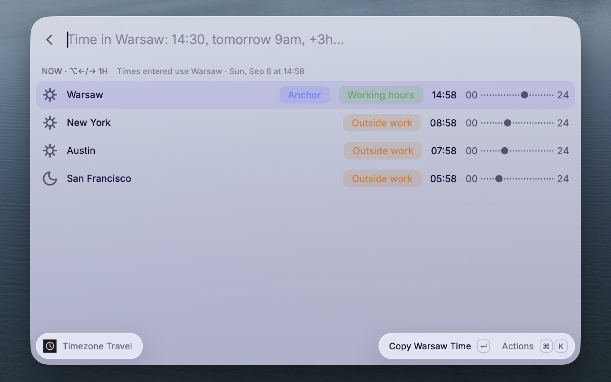

# Timezone Travel

See one moment everywhere.

Timezone Travel turns time-zone planning into one keyboard flow. Choose a moment in your anchor city and
every saved city moves with it, so you can answer “what time is that for everyone?” without doing the
arithmetic yourself.



## One Timeline, Every City

- **Travel by keyboard** — press `Option` + `←/→` on macOS or `Alt` + `←/→` on Windows to move every
  city by one hour.
- **Type the time you mean** — jump to `9am`, `14:30`, `tomorrow 09:00`, `+3h`, or `-30m`.
- **Spot good meeting times** — see local working hours, daytime, and date changes at a glance.
- **Keep the comparison aligned** — every row uses the same 24-hour timeline and shared instant.
- **Add cities without time-zone syntax** — search by city, country, abbreviation, or time-zone name.
- **Copy what you need** — copy one city's reading or every local time in one action.

## Get Started

1. Open **Manage Cities** and add the places you care about.
2. Put the city that should interpret typed times first by making it the anchor.
3. Open **Timezone Travel**, type a time or move in one-hour steps, and watch every city update together.

Use **Return to Now** from the action menu whenever you want to resume the live clock.

## Time Shortcuts

- `14:30` or `9am`
- `tomorrow 09:00` or `yesterday 6pm`
- `+3h`, `-30m`, or `+1day`
- `now`

## Preferences

Choose a 12-hour or 24-hour clock from the extension preferences.

## Privacy

Timezone Travel makes no network requests and requires no account or API key. Your city list is stored locally by Raycast.

## Author

Created and maintained by [Marcin Mincer](mailto:marcin.mincer@gmail.com).

## Development

```sh
npm install
npm test
npm run typecheck
npm run lint
npm run build
npm run dev
```
