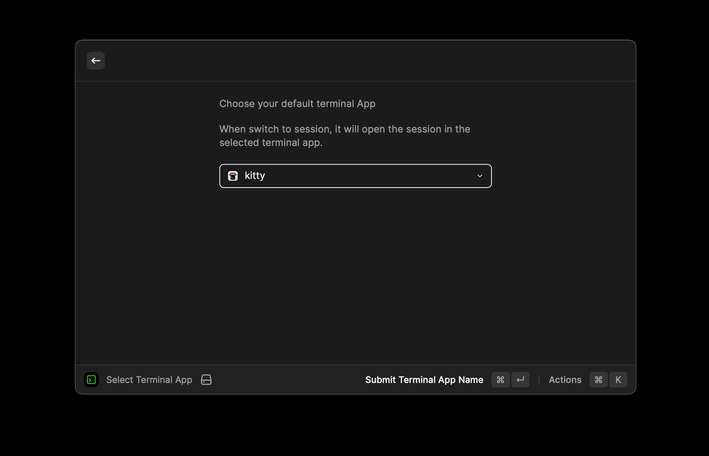
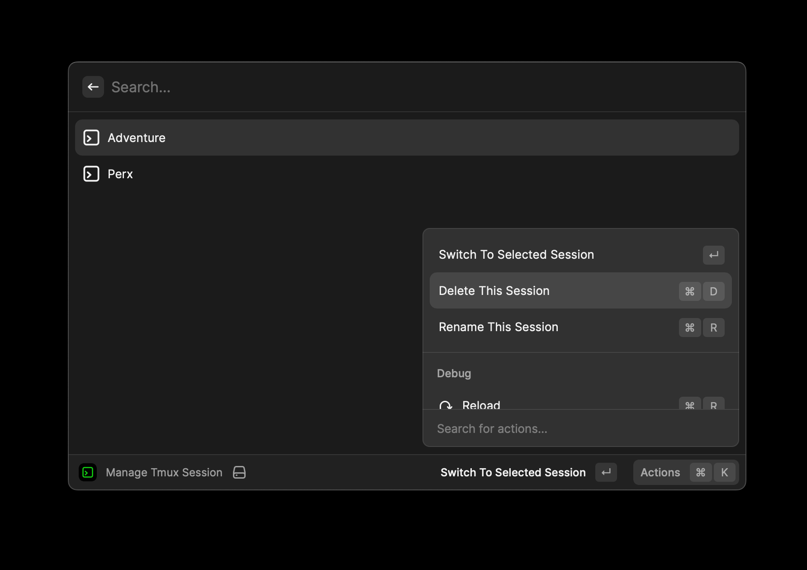
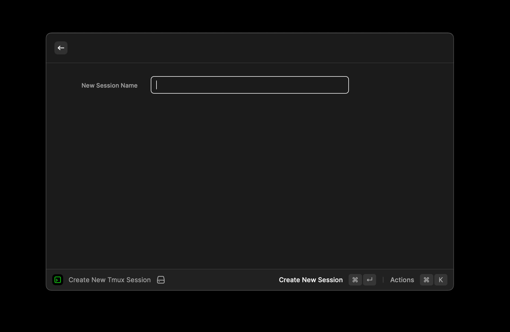

# Tmux Sessioner

## Description

This is a extension for raycast to manage tmux sessions.

## Features

- Switch between sessions 🔄
- Switch between windows 🔄
- Attach to sessions/windows automatically with setup terminal 🖥
- Attach to sessions automatically with setup terminal 🖥
- Create new sessions 🆕
- Delete sessions 🗑
- Rename sessions 📝

## How to use

1. Install [Raycast](https://raycast.com/) 📦
2. Install [Tmux](https://linuxize.com/post/getting-started-with-tmux/) 📦
3. Install [Extension](https://www.raycast.com/raycast) 📦
4. Open Raycast and type `Tmux Sessioner` to see all commands 📟
5. First time you need to setup your terminal to attach to sessions automatically 🖥
   
6. Enjoy Mangaging your sessions 🎉
   
7. You can create a new session with type `Create New Session` 🆕
   

## TODO

- [ ] Label sessions 🏷
- [ ] Prioritize sessions 📈
- [ ] Allow Creating Session with predefined windows 🖼
- [ ] Create Windows
