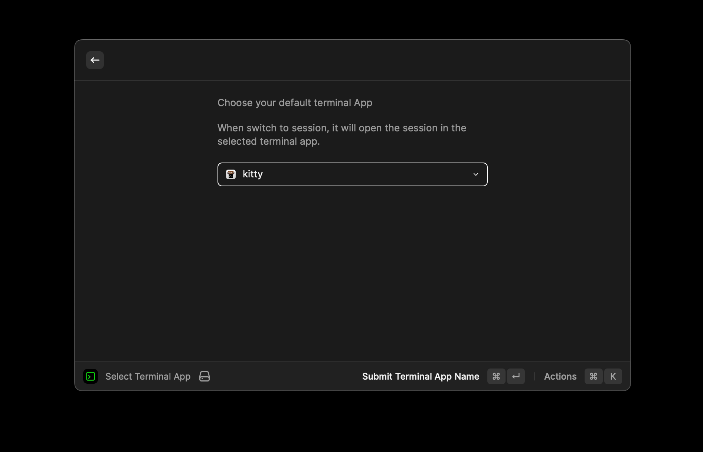
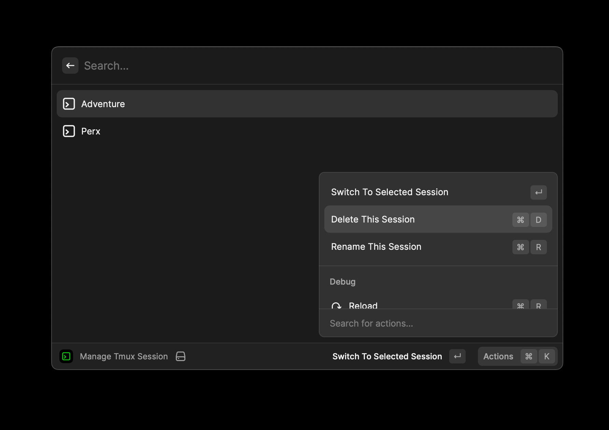
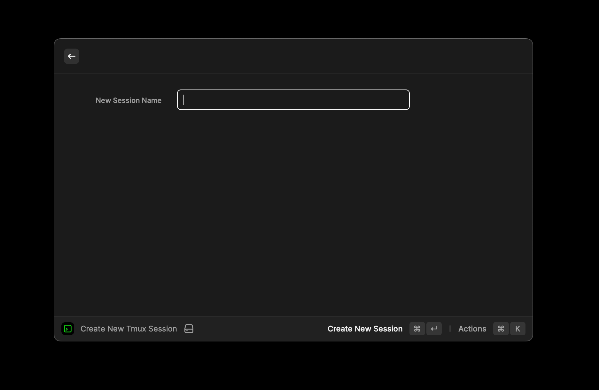

# Tmux Sessioner

## Description

This is a extension for raycast to manage tmux sessions.

## Features

- Switch between sessions 🔄
- Switch between windows 🔄
- Attach to sessions/windows automatically with setup terminal 🖥
- Attach to sessions automatically with setup terminal 🖥
- Open sessions in a new terminal tab or window 🪟
- Create new sessions 🆕
- Bootstrap project sessions: create a folder and run a startup command in one go 🚀
- Delete sessions 🗑
- Kill multiple sessions at once 🧹
- Search commands and output across all sessions' scrollback 🔍
- Rename sessions 📝

## Searching session output

`Search Session Output` greps the scrollback of every pane in every session, so you can find that command you ran or error you saw without remembering which session it was in. Matches are grouped by session with surrounding context; press `⏎` to switch there, or open it in a new terminal tab. Tip: raise tmux's `history-limit` (e.g. `set -g history-limit 50000`) to search further back.

## Bootstrapping project sessions

`Create New Session` can go beyond switching directories:

- **Create New Folder**: creates `<New Session Default Directory>/<name>` and starts the session inside it. Enable it per-launch in the form, or permanently with the *Create New Folder by Default* preference.
- **Startup Command**: any shell line typed into the fresh session (so the session survives when the command exits). Set a default once in the *New Session Startup Command* preference — e.g. `npm run dev`, `claude`, or compose steps like `git init && claude` — and tweak it per-launch when needed.
- The command accepts the session name as an argument, so `Create New Session myproject` from the Raycast root search prefills everything: press `⌘⏎` and you get a new terminal tab, in a new folder, with your startup command already running.
- With the *Open in Terminal After Create* preference enabled, opening the session in a new tab/window becomes the default submit action — plain `⏎` does it all.

## How to use

1. Install [Raycast](https://raycast.com/) 📦
2. Install [Tmux](https://linuxize.com/post/getting-started-with-tmux/) 📦
3. Install [Extension](https://www.raycast.com/raycast) 📦
4. Open Raycast and type `Tmux Sessioner` to see all commands 📟
5. First time you need to setup your terminal to attach to sessions automatically 🖥
   
6. Enjoy Mangaging your sessions 🎉
   
7. You can create a new session with type `Create New Session` 🆕
   

## TODO

- [ ] Label sessions 🏷
- [ ] Prioritize sessions 📈
- [ ] Allow Creating Session with predefined windows 🖼
- [ ] Create Windows
