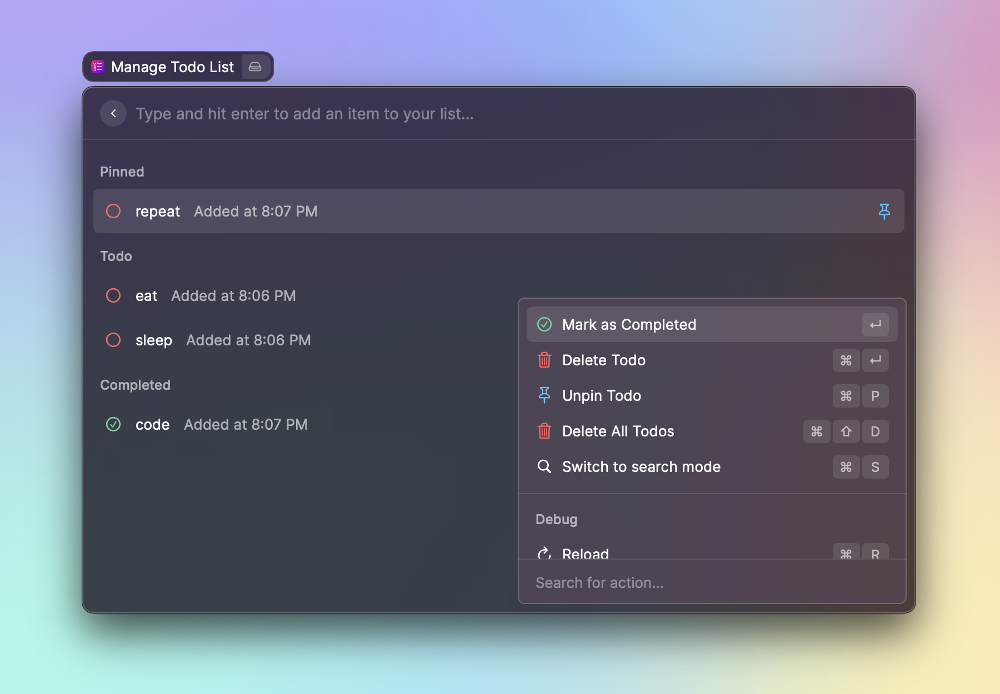
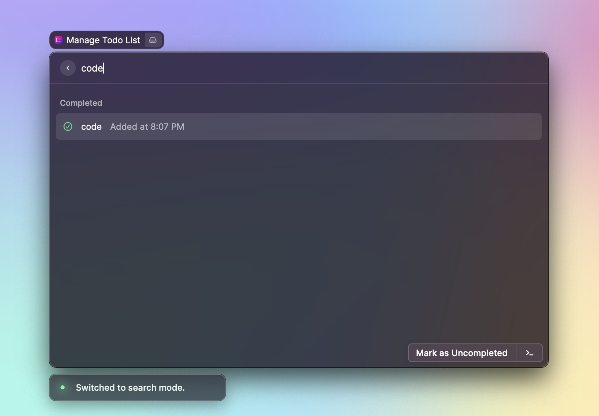

# Todo List

An extension for creating and managing a todo list. Create and delete items, mark tasks as completed and pin important items.

## Insert Mode

## Search Mode

## Commands

- Add item: type into search bar in **insert mode** and use <kbd>⏎</kbd>
- Toggle selected item between completed and uncompleted: <kbd>⏎</kbd>
- Delete selected item: <kbd>⌘</kbd><kbd>D</kbd> or <kbd>⌘</kbd><kbd>⏎</kbd>
- Pin or unpin selected item: <kbd>⌘</kbd><kbd>P</kbd>
- Delete all items: <kbd>⌘</kbd><kbd>⇧</kbd><kbd>D</kbd>
- Switch between insert mode and search mode: <kbd>⌘</kbd><kbd>S</kbd>
