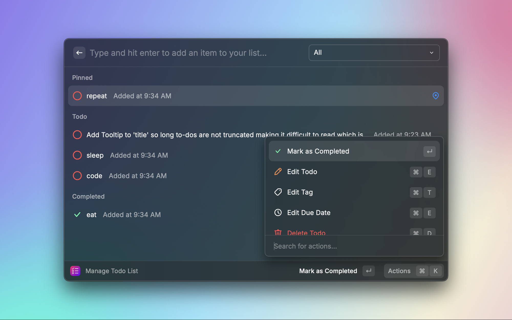
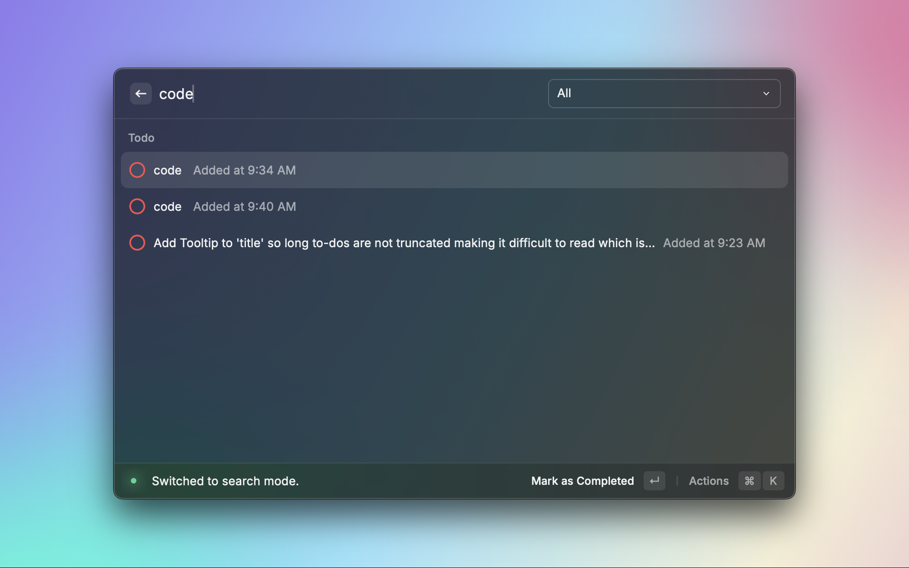

  

# Todo List

Create, search, and organize a local todo list on macOS and Windows. Pin tasks, assign a tag, set priorities and due dates, and mark work as completed. The menu-bar command is available on macOS only.

## Add and search tasks

Type in **insert mode** and press Enter to create a task. Switch to **search mode** to find existing tasks. When the search bar is empty, Enter toggles the selected task's completion.

Use the tag dropdown to filter your list. **All Todos** shows every task, while a user tag named **All** filters to that tag. New tasks inherit the active tag unless you provide a different tag. **Edit Tag** lets you pick an existing tag, type a new one, or clear the tag.

Enable **Natural language parsing** in extension preferences to extract dates, a `#tag`, and priority shortcuts from new tasks. For example, `Send the report tomorrow #work !h` sets a due date, tag, and high priority. Use `!m` for medium priority and `!l` for low priority.

## Keyboard shortcuts

| Action                             | macOS        | Windows      |
| ---------------------------------- | ------------ | ------------ |
| Create a task or toggle completion | Enter        | Enter        |
| Edit task                          | Cmd+E        | Ctrl+E       |
| Apply edits                        | Enter        | Enter        |
| Edit tag                           | Cmd+T        | Ctrl+T       |
| Edit due date                      | Cmd+Shift+E  | Ctrl+Shift+E |
| Delete task                        | Cmd+D        | Ctrl+D       |
| Pin or unpin                       | Cmd+Option+P | Ctrl+Alt+P   |
| Set priority                       | Cmd+Shift+P  | Ctrl+Shift+P |
| Open task URL                      | Cmd+O        | Ctrl+O       |
| Mark all incomplete                | Cmd+R        | Ctrl+R       |
| Clear completed tasks              | Cmd+Option+C | Ctrl+Alt+C   |
| Delete all tasks                   | Cmd+Shift+D  | Ctrl+Shift+D |
| Switch insert/search mode          | Cmd+S        | Ctrl+S       |

Use **Cancel** in the Actions menu to leave editing without saving.

## Back up and recover tasks

Run **Export Todo Backup** to save a JSON copy to a folder you choose. It includes titles, tags, priorities, due dates, and pinned and completed states. Keep an exported copy outside Raycast before an upgrade, migration, or reinstall.

Run **Import Todo Backup** to restore an exported backup or an original `todo.json` file. It accepts both the legacy two-array format and the current section format. Import previews the task count and asks before replacing the list. A separate copy of the current file is preserved first, even if that file is corrupt. Import replaces the list; it does not merge tasks.

Normal saves also keep the previous saved version in `todo.json.backup`. The import command's **Open Todo Storage Folder** action opens the current storage directory. Choose `todo.json.backup` in the import form to restore that version. This backup lives alongside your data, so it does not replace an exported backup stored elsewhere.

Unreadable or invalid data produces an error instead of silently becoming an empty list. If another command has saved a newer list, the command reloads it without overwriting those changes. Select the task in the refreshed list and retry your edit.

### Missing tasks after migrating to Raycast v2

If the migration left the extension's storage folder empty, this extension cannot reconstruct the missing tasks. Use **Import Todo Backup** with a saved export, a copy of the original extension's `todo.json`, or a file recovered from a system backup. The import command works independently of the main list, including when the current file is corrupt. No migration-specific storage location is assumed, and the extension does not scan other applications' data.

## Raycast AI

Two tools read your local list:

- **Search Todos** filters by title text, exact tag, completion, pinned state, priority, or due date. Results are paginated.
- **Summarize Todos** reports open and completed counts, tags, priorities, overdue tasks, and tasks due today.

Try `@todo-list Show my incomplete tasks tagged All`, `@todo-list What is overdue?`, or `@todo-list Summarize my workload and suggest what to do next`.

These tools do not modify tasks. Deadline and priority summary counts cover incomplete tasks only. Due-today and overdue counts can overlap. Date filters use your local timezone, and upcoming means tomorrow or later.

## Development

Run `npm test`, `npm run build`, `npx tsc --noEmit`, and `npm run lint`. Build first to generate `raycast-env.d.ts` on a fresh clone. `npx ray evals` checks AI tool selection using mocked task data.

Before release, smoke-test shortcuts and search-mode switching in Raycast on both platforms. On macOS, also verify that toggling a task from a sorted, limited menu-bar list changes the task you selected. Check tag selection, backup export/import, and recovery from an invalid file using disposable test data.
