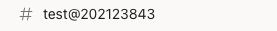
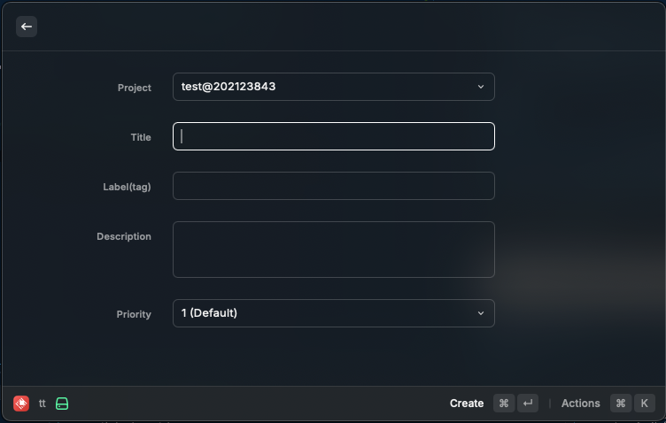
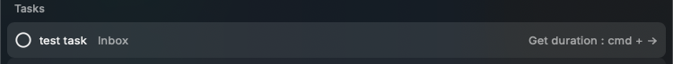

# Raycast Todoist and Toggl Track Extension
[日本語](#日本語) / [English](#english)

## English
### Overview
This extension integrates the time tracking feature of [Toggl](https://toggl.com/) with the task management tool [Todoist](https://app.todoist.com).  
It is designed for individual task management, so some features are limited.

#### Features
- Create/Edit/Complete Todoist tasks (Project, Title, Description, Labels, Priority)
- Start/Stop time tracking for tasks (Tracking is done via Toggl.)
- Display total time spent on a task (Only for tasks managed through this extension)

(Updates planned for the future)

### Initial Setup
Set up your [Toggl API Token](https://track.toggl.com/profile) and [Todoist API Token](https://app.todoist.com/app/settings/integrations/developer).

### Linking Toggl Projects with Todoist Projects
Append `@${Toggl Project ID}` to the end of the Todoist project name.
```
Example: TestProject@222222222
```
Example in the Todoist app:  


### Creating a Todoist Task
Press `enter` on "Create new task".  


- `cmd + enter` to create a task.
- `cmd + shift + enter` to create a task and start Toggl time tracking.
  
*If the project is not linked, the time tracking will start in the default Toggl workspace.*

## 日本語
### 概要
[Todoist](https://app.todoist.com)のタスク管理ツールに[Toggl](https://toggl.com/)の時間計測機能を連携させる拡張機能です。<br>
個人単位でのタスク管理向けの拡張機能なので、それぞれ一部機能に制限があります。
#### 【できること】
- Todoistタスクの作成/編集/完了（プロジェクト、タイトル、説明、ラベル、優先度）
- タスクの時間測定開始/終了（測定自体はTogglで行います。）
- タスクにかかった総時間の表記 ※この拡張機能で連携されたタスク対象


(今後更新予定)

### 初期設定
[Toggl API Token](https://track.toggl.com/profile)と[Todoist API Token](https://app.todoist.com/app/settings/integrations/developer)をそれぞれ設定する。

### Toggl ProjectとTodoist Projectの連携方法
Todoistのプロジェクト名の語尾に@${Toggl Project ID}をつけてください。
```
例：TestProject@222222222
```
Todoistアプリだとこんな感じ <br>


### Todoist タスクの作成
「Create new task」を``enter``<br>
<br>

``cmd + enter``タスクを作成。<br>
``cmd + shift + enter``タスクを作成しTogglの時間測定開始。<br>
<br>
*プロジェクトの連携がされてない場合、TogglのDefault workspaceで自動的に時間測定されます。

### Todoist タスクの更新
任意のタスクを``cmd + e``<br>
<br>

``cmd + enter``タスクを更新。<br>
<br>

### Todoist タスクの完了
任意のタスクを``cmd + enter``<br>
<br>

### Toggl 時間測定開始
任意のタスクを``enter``<br>
<br>

### Toggl 時間測定停止
Runningタスクを``enter``<br>
<br>

### Toggl タスクにかかった時間を計算
Runningタスクを``cmd + ->``<br>
<br>

###【計算方法】
- この拡張機能からTogglタイマーを開始した瞬間に、TodoistのコメントにTimerIDが追記されていきます。
- ``cmd + ->``された瞬間に、TimerIDからTogglAPIを経由して合計時間を取得し表示します。（場合によっては処理がちょっとかかります。）