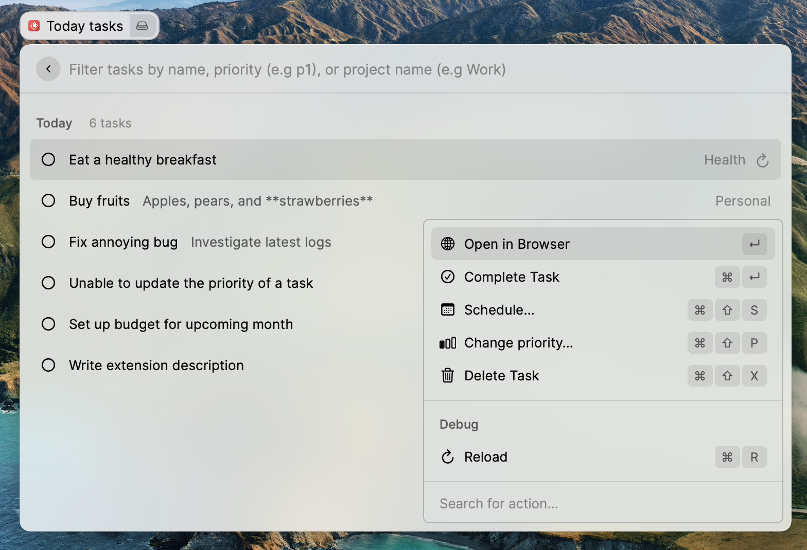

# Raycast for Todoist

**This extension is not created by, affiliated with, or supported by Doist.**

Bring Todoist to Raycast so that you can manage your tasks easily. No more context-switching!

## Getting started

Before using the command, you need to retrieve your Todoist token located in the [integration settings view](https://todoist.com/prefs/integrations)

## Features

- See your tasks due today
- See your upcoming tasks grouped by dates
- See all your projects, tasks by project and if your project is starred
- Create a task

For each task, you can:

- See its associated project if the list is date-based
- See its associated date if the list is project-based
- See if the task is recurring or not
- See the task's priority with a colored circle
- Open the task in Todoist
- Complete the task
- Schedule the task
- Change its priority
- Delete the task
- Filter the tasks by name, priority or by project name

## Future improvements

- Support tasks set at a certain time
- Support sections in task creation
- Sub-projects and sub-tasks are not supported because Raycast only has simple lists and mixing them with sections would make the list less readable.

## Limitation

- Tasks in the "Today" and "Upcoming" views are not ordered the same as in your Todoist app because of a limitation from the [Todoist REST API](https://developer.todoist.com/rest/v1/#overview). The [Sync API](https://developer.todoist.com/sync/v8/) supports it but is not adapted for a Raycast extension.
- You can't move a task to another project because of a limitation from the Todoist REST API.
- Filters are not supported because of a limitation from the Todoist REST API.
- It's not possible to get tasks only assigned to you when sharing projects because of a limitation from the Todoist REST API.
