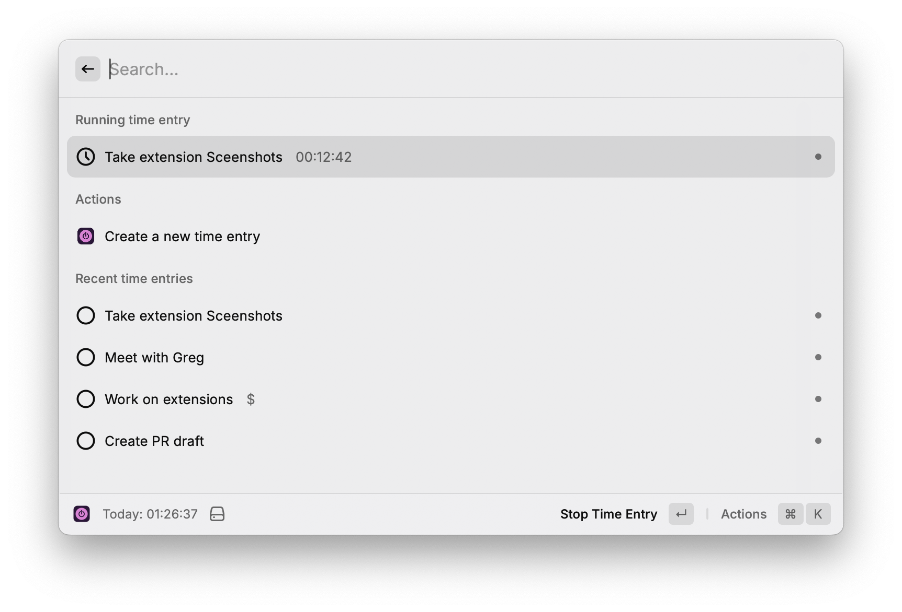
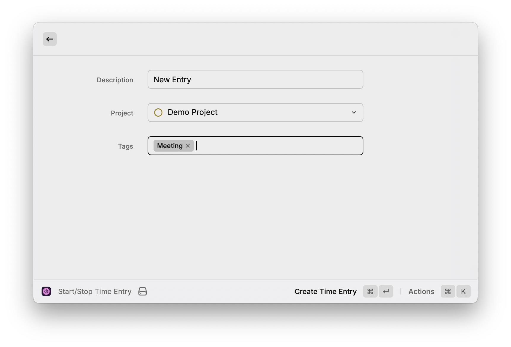
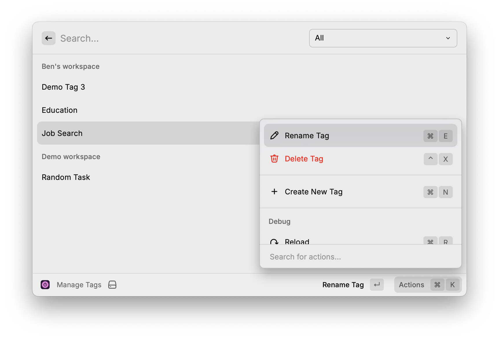
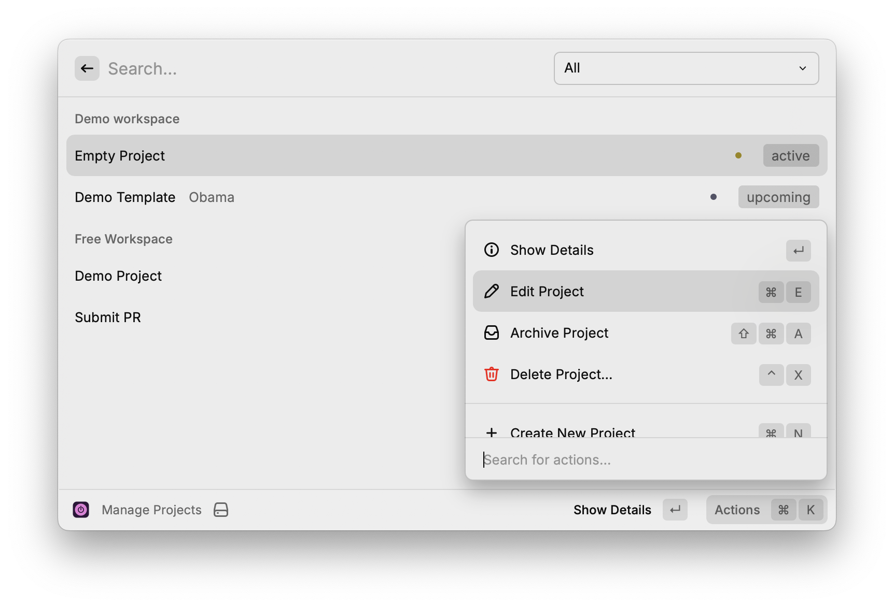
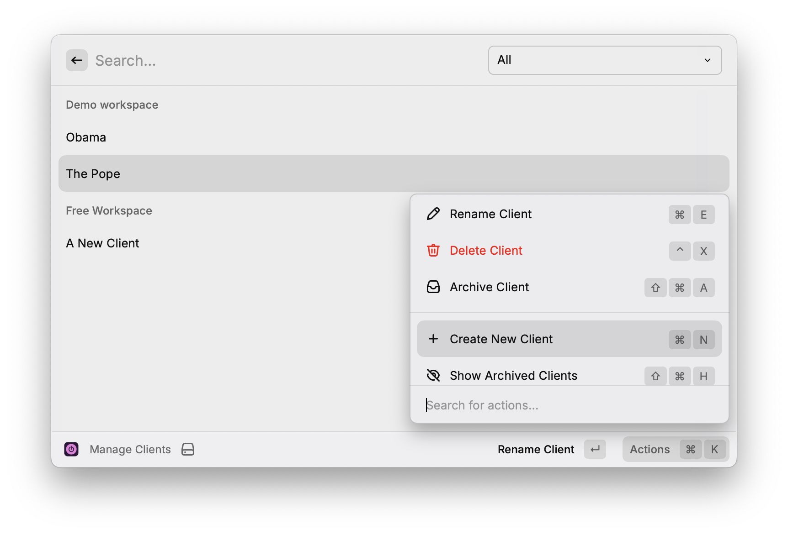
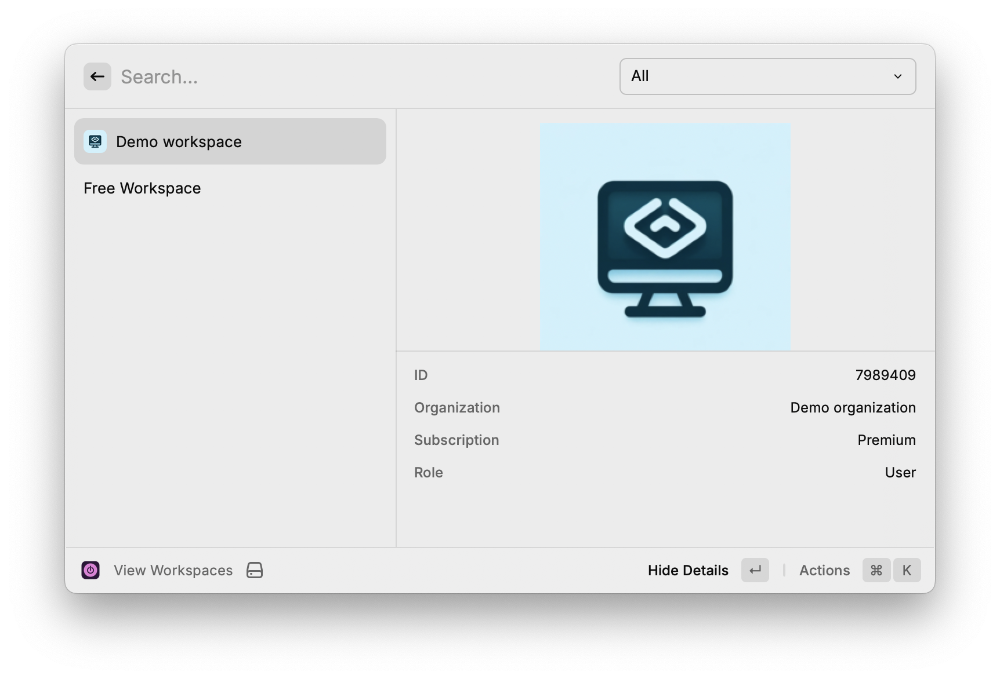

# Raycast Toggl Track Extension

## Getting Started

To use this extension, you need your Toggl Track API Token. This can be found on the bottom of your profile in toggle Track: https://track.toggl.com/profile

## Commands

### Start/Stop Time Entry

The command lists out recent time entries and allows you to resume them.

The running time entry is always visible on the top of the list with its duration, description, and project. It is easily stopped by clicking on it or using the enter command.

Select "Create a new time entry" and pressing enter will bring you to the time entry from, allowing you to create one from scratch.

### Manage Tags

This command list all the tags you have access to. You can create, rename, and delete them, assuming you have the appropriate permissions.

### Manage Projects

This will show you all the projects you have access to. If you have the appropriate permissions, you can create, rename, delete, archive, and restore a client.

Fields for premium project features will come in an update.

### Manage Clients

The command lists of all clients you have access to. If you have the appropriate permissions, you can create, rename, delete, archive, and restore a client.

### Manage Workspaces

This command is a view-only list of all the workspaces you're a part of.

It is disabled by default, but can enabled from Raycast's extensions settings.

### Menu Bar

See what time entry is currently in your Menu Bar. Click to see the list of recent time entries, which allows you to resume them.

You can easily stop the running time entry by clicking on it or using the enter command.
