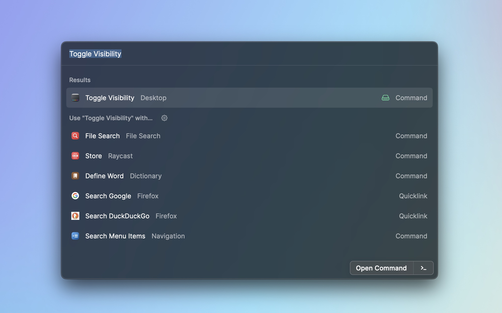

<h3 align="center"> 
   <strong style="">Toggle Desktop Visible</strong>
    
</h3>

  
    A Raycast Toggle Desktop Visible Extension. Very easy to use.
  

---

You can toggle the Desktop file and folder Show and Hidden. sometimes we don't want to see the Desktop have so many files or folders,
So the extension can help you, you can easily switch to Desktop visible.

### Toggle desktop

