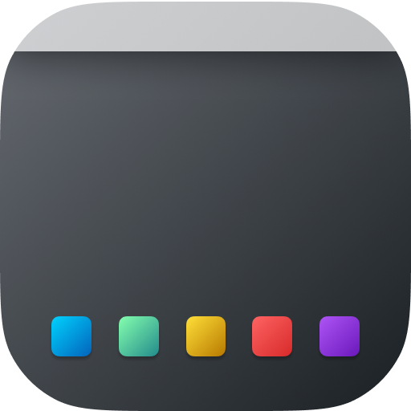

   

<h3 align="center"> 
   <strong style="">Toggle Desktop Visible</strong>
    
</h3>

  
    A Raycast Toggle Desktop Visible Extension. Very easy to use.
  

---

You can toggle Desktop file and folder Show and Hidden. sometimes we don't want see Desktop have so many files or folder,
So the extension can help you, you can easily switch Desktop visible.

### Command

### Show Desktop

### Hidden Desktop

