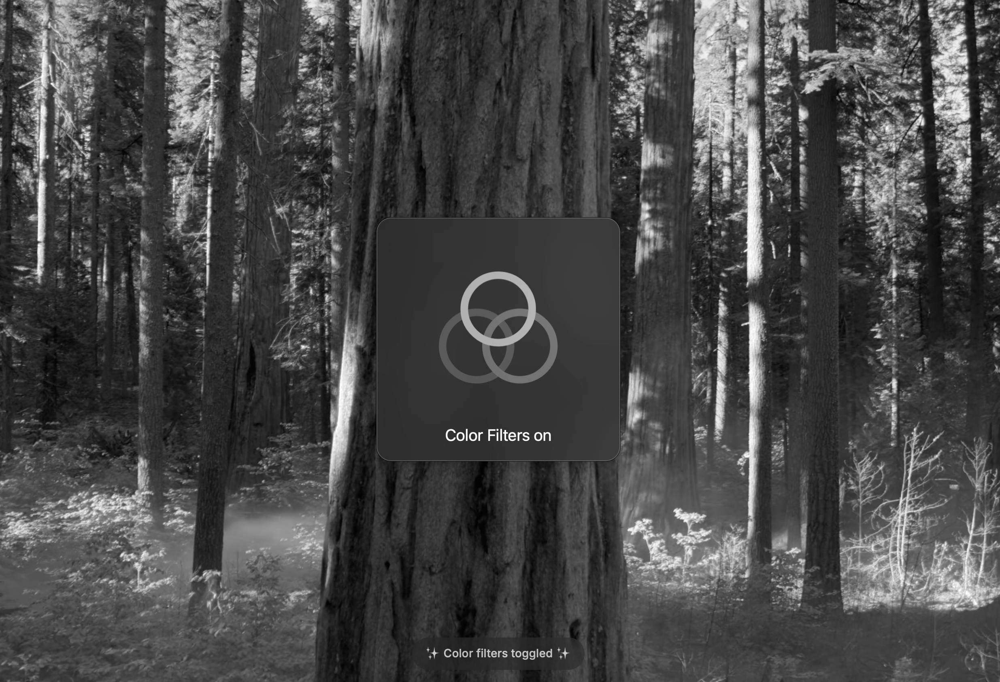

# Toggle Grayscale

Instantly toggle your Mac's Color Filters accessibility feature on/off without opening System Settings. Switch between color modes with a single command. This is useful for reducing blue light and color stimulation in the evening.

## Showcase

## Credits
Created by [zcsabbagh](https://github.com/zcsabbagh)
