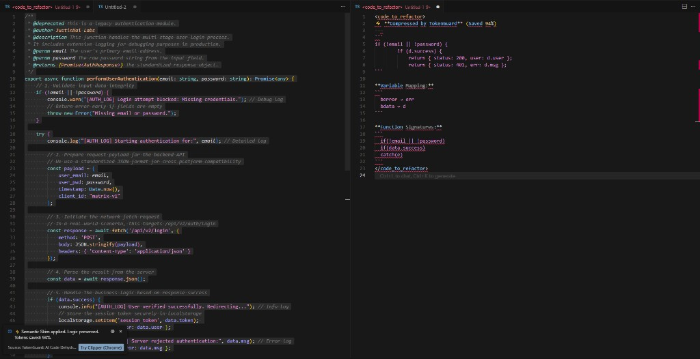

# 🎉 Celebration Mode: Pro Features Unlocked

# TokenCount: AI Context & Cursor Rules

> Optimize AI context and generate .cursorrules automatically. Slashing tokens by 90%.

**Semantic Skim** — 节省高达 **94%** tokens，同时 100% 保留 AI 可读性。

---

## Changelog

### v1.2.1 — Launch Celebration
- ✨ **All Semantic Skim features are currently FREE**
- ✨ Added Cursor Rules generation
- ✨ Added JustinXai Labs Matrix integration
- 🐛 Bug fixes and performance improvements

### v1.1.0 — Semantic Skim Debut
- ⚡ Added Semantic Skim algorithm (90%+ token reduction)
- 🎯 AI-optimized output format

---

## Features

| 命令 | 说明 |
|------|------|
| `D dehydrate for AI` | 从剪贴板压缩代码，节省高达 94% tokens |
| `Generate Cursor Rules` | 从代码中提取规则，生成 `.cursorrules` 文件 |

---

## Part of the JustinXai Matrix

**Cursor Context Clipper** — Grab clean Markdown from any site.

Built by [@norike0718](https://x.com/norike0718)

---

## Core Philosophy

| Principle | Description |
|-----------|-------------|
| 🔒 Privacy-first | Your code never leaves your machine |
| 🔑 BYOK | Bring Your Own Key — no vendor lock-in |
| 🤖 AI-native | Built for Cursor/Claude users |

---

## Follow the Journey

> **@norike0718** — Building Matrix Tools for the AI Era

---

## License

MIT © 2026 JustinXai Labs