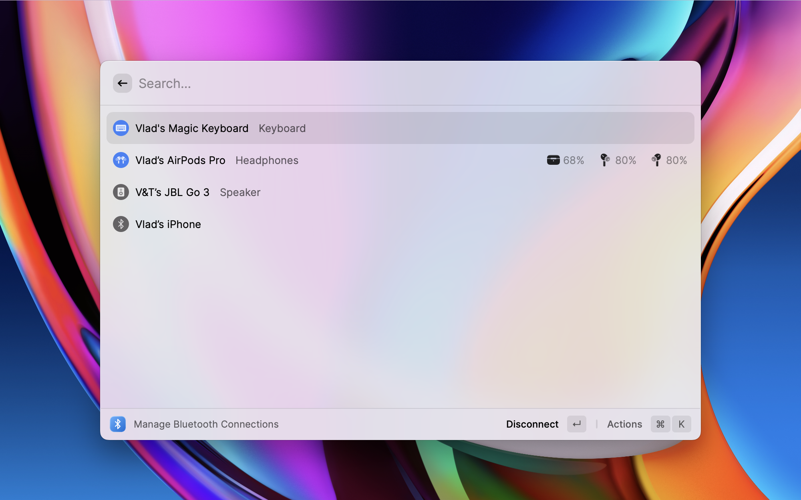

  
  <h1 align="center">Toothpick</h1>

  
  

This extension lets you control your Bluetooth devices with a few keystrokes. 
Connecting to your Bluetooth devices <!--and changing your AirPods' noise-cancelling profile -->has never been faster :)

## Getting Started

Visit this extension's [store page](https://www.raycast.com/briankosw/toothpick) to get started. 
After installing, follow the instructions on screen, and you should be good to go!

## Feedback

A lot of workarounds were used to implement many of the core functionalities. Not to mention that this extension was also a whim project. So, I would be happy to hear what you think of it and how it could be improved upon.

  
  

## Contributing

There are many more devices I want to support and I need <i>your</i> help for that! 
If you have any of the devices below <i>or</i> wish to have any unlisted device supported, all you need to do is:

0. Connect your device
1. Open this extension in Raycast
2. Highlight your device
3. Press 'Command + K'
4. Run 'Copy Device Data' command
5. Paste your data in an issue using [this template](https://github.com/raycast/extensions/issues/new?template=extension_feature_request.yml&extension-url=https%3A%2F%2Fraycast.com%2Fbriankosw%2Ftoothpick&description=%2A%2ADevice+brand+and+model%2A%2A%0A%0A%0A%0A%2A%2ADevice+data%2A%2A%0A%0A%0A%0A&title=%5BToothpick%5D+Device+support+form).
6. ???
7. Profit

### Wanted devices

- Sony WF-1000XM4
- Sony WH-1000XM4
- Beats X
- Beats Solo 3
- Beats Solo Pro
- Beats Powerbeats
- Beats Powerbeats 3
- Beats Powerbeats Pro
- Beats Studio 3
