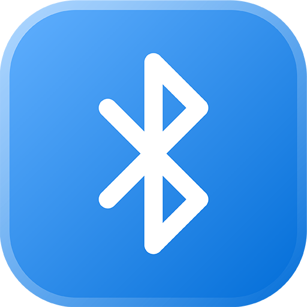

  
  <h1 align="center">Toothpick</h1>

  
  

This extension lets you control your Bluetooth devices with a few keystrokes.  
Connecting to your Bluetooth devices has never been faster :)

## Getting Started

Visit this extension's [store page](https://www.raycast.com/VladCuciureanu/Toothpick) to get started.  
After installing, follow the instructions on screen, and you should be good to go!

## Setting up favorite devices

1. Go to the extension's settings.
2. Enable the desired number of favorite device commands.
3. Ensure "Toothpick" (the extension) is highlighted (and not a command).
4. Write your device's name in the corresponding preference field.

You should now be able to connect to your device of choice via the configured commands.

## Enabling 'blueutil' backend

The default 'AppleScript' Bluetooth backend works and is available out-of-the-box on modern macOS installs.  
That said, AppleScript itself is flaky at best. Various device-specific issues popped up with no way to reproduce them.  
As a solution, Toothpick now has an opt-in Bluetooth backend based on 'blueutil'. It is more stable, faster and easy to set up.  

1. Install 'blueutil' via 'brew'.
2. Go to the extension's settings.
3. Click on the 'Bluetooth Backend' dropdown.
4. Select 'blueutil (Experimental)'

As implied by the backend's name, this feature is experimental and hasn't been tested extensively.  
If any issues pop up, please report them through the feedback links below. 

## Feedback

A lot of workarounds were used to implement many of the core functionalities.  
Not to mention that this extension was also a whim project. So, I would be  
happy to hear what you think of it and how it could be improved upon.

- [Request Feature](https://github.com/raycast/extensions/issues/new?assignees=&labels=extension%2Cfeature+request&template=extension_feature_request.yml&title=%5BToothpick%5D+...&extension-url=https://www.raycast.com/VladCuciureanu/Toothpick)
- [Report Bug](https://github.com/raycast/extensions/issues/new?assignees=&labels=extension%2Cbug&template=extension_bug_report.yml&title=%5BToothpick%5D+...&extension-url=https://www.raycast.com/VladCuciureanu/Toothpick)

## Contributing

There are many more devices I want to support and I need _your_ help for that!  
If you have any of the devices below _or_ wish to have any unlisted device  
supported, all you need to do is:

0. Connect your device
1. Open this extension in Raycast
2. Highlight your device
3. Press 'Command + K'
4. Run 'Copy Device Data' command
5. Paste your data in an issue using [this template](https://github.com/raycast/extensions/issues/new?assignees=&labels=extension%2Cfeature+request&template=extension_feature_request.yml&title=%5BToothpick%5D+Device+Support+Form&extension-url=https://www.raycast.com/VladCuciureanu/toothpick&description=%3Cb%3EDevice%20brand%20and%20model%3C%2Fb%3E%0AReplace%20this%20line%20with%20your%20device%27s%20brand%20name%20and%20model%0A%0A%3Cb%3EDevice%20data%3C%2Fb%3E%0AReplace%20this%20line%20with%20the%20copied%20data).
6. ???
7. Profit

### Wanted devices

- Beats X
- Beats Solo 3
- Beats Powerbeats
- Beats Powerbeats 3
- Beats Powerbeats Pro
- Beats Studio 3
