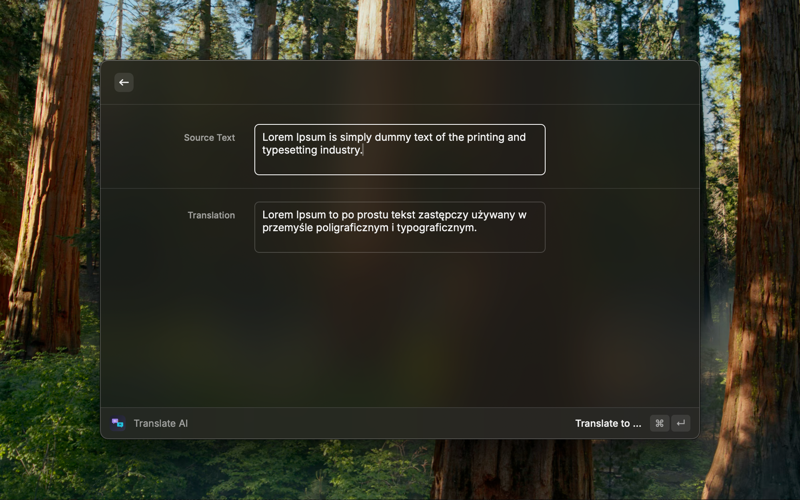

# Translate AI

A Raycast extension for quick text translation powered by Claude or OpenAI.



## Features

- Automatically captures selected text from any app
- Translates to English, Polish, or Russian
- Auto-detects source language
- Optional automatic clipboard copy
- Supports both Claude (Anthropic) and OpenAI APIs

## Setup

1. Install the extension from the Raycast Store
2. Open Raycast → Extensions → Translate AI → Preferences
3. Enter at least one API key:
   - **Claude API Key** (Anthropic): `sk-ant-...`
   - **OpenAI API Key**: `sk-...`

If both keys are provided, Claude is used by default.

## Usage

1. Select text in any application (optional)
2. Open Raycast and run "Translate AI"
3. Edit the source text if needed
4. Choose a target language from the "Translate to ..." submenu
5. View the translation in the result field

## Development

```bash
npm install          # install dependencies
npm run dev          # run in development mode
npm run build        # build the extension
npm run lint         # check code style
npm run fix-lint     # auto-fix linting issues
```
