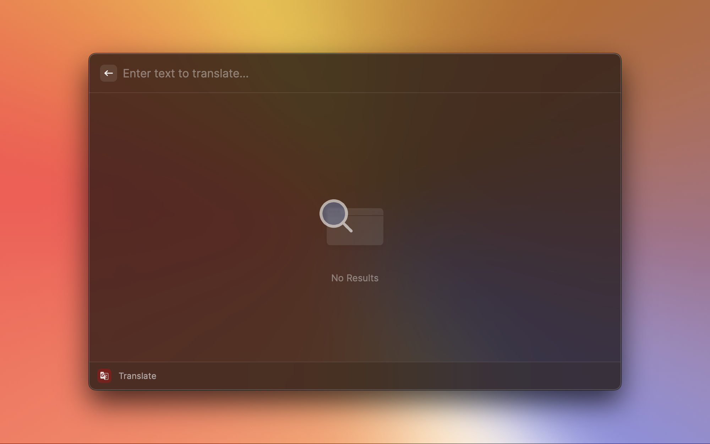
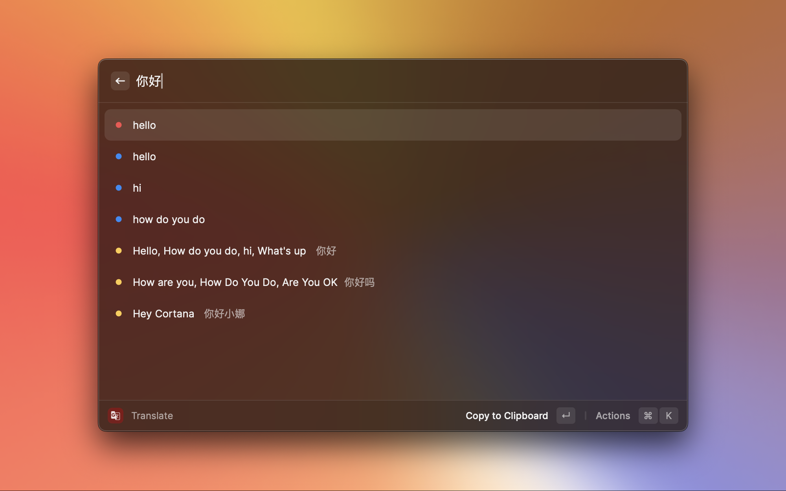
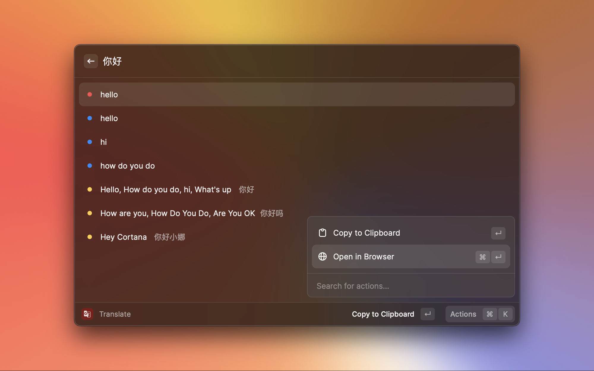

# Translate

Raycast Youdao Translate extension.

## Usage

The current release Raycast Store is under review and can be used locally.

``` bash
npm run dev
```

## Configure

- [Configure Key & Secret](https://github.com/wensonsmith/YoudaoTranslator/wiki/%E8%8E%B7%E5%8F%96%E6%9C%89%E9%81%93%E7%BF%BB%E8%AF%91-Key-%E4%B8%8E-Secret).
- Configure alias(`yd`) and hotkey(`Cmd + T`).

And, enjoy :)

## Interface





## Special Thanks

This project is based on and inspired by Raycast extension [Youdao Translate](https://github.com/raycast/extensions/tree/main/extensions/youdao-translate).

## License

[MIT](./LICENSE) License © 2023 [Hongbusi](https://github.com/Hongbusi) 
