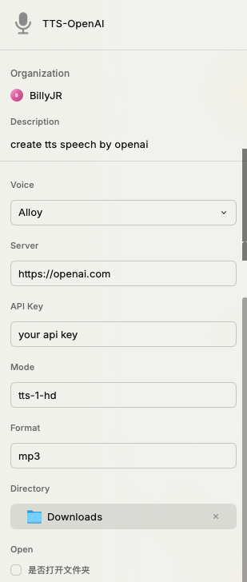
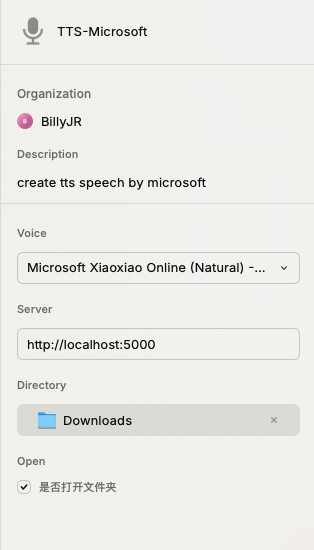

# tts

text to tts speech

## Usage

type `tts-microsoft` or `tts-openai` in the raycast and follow the instructions

Copy the speech text you want to generate to the clipboard and run the command. The generated speech will be saved in the same directory as the file.

### tts-microsoft

> **note**
>
> you need to install the `edge-tts` by pip
>
> ```bash
> pip install edge-tts
> ```
>
> then run the server in your local machine or remote server
>
> ```python
> from gevent import pywsgi
> from flask import Flask, request, Response
> import edge_tts
> import uuid
> import base64
> 
> app = Flask(__name__)
> 
> 
> @app.route('/tts', methods=['POST'])
> async def tts():
>     data = request.get_json()
>     text = base64.b64decode(data['text']).decode('utf-8')
>     voice = data['voice']
>     print('text: ', text)
>     print('voice: ', voice)
>     try:
>         filename = './audio/' + str(uuid.uuid4()) + '.mp3'
>         communicate = edge_tts.Communicate(text=text, voice=voice)
>         await communicate.save(filename)
>         with open(filename, 'rb') as f:
>             audio = f.read()
>     except FileNotFoundError as e:
>         return Response(status=500, response='error')
>     return Response(audio, mimetype='audio/mpeg', headers={'Content-Disposition': 'attachment;filename=audio.mp3'})
> 
> 
> if __name__ == '__main__':
>     server = pywsgi.WSGIServer(('localhost', 5000), app)
>     server.serve_forever()
> ```
>
> 


### tts-openai

> **note**
> input your openai api key in the following instruction

## Screenshots


