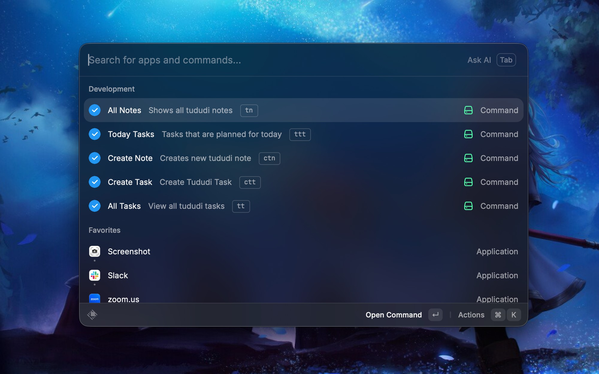
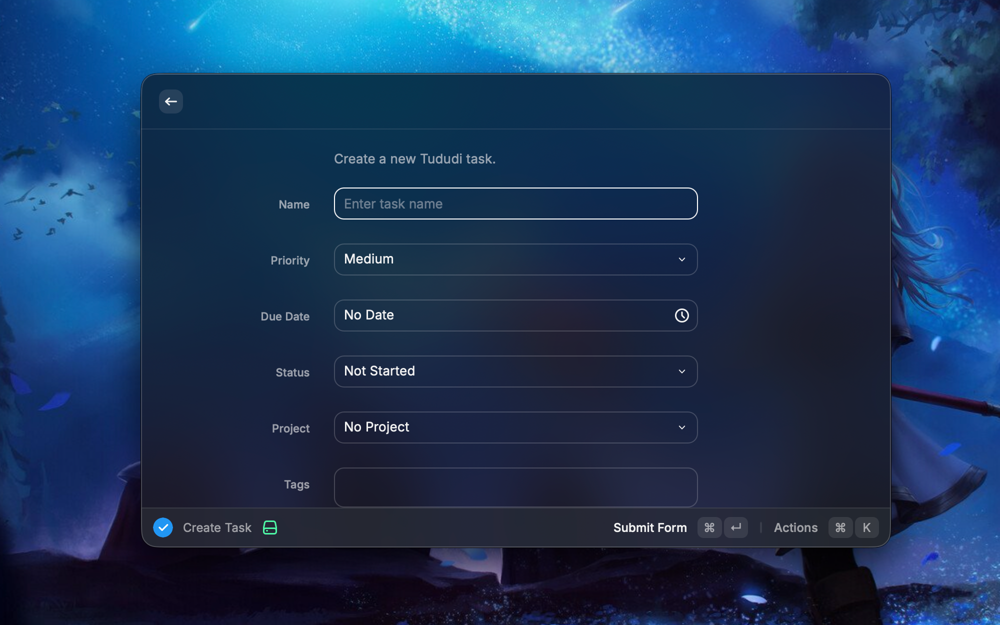
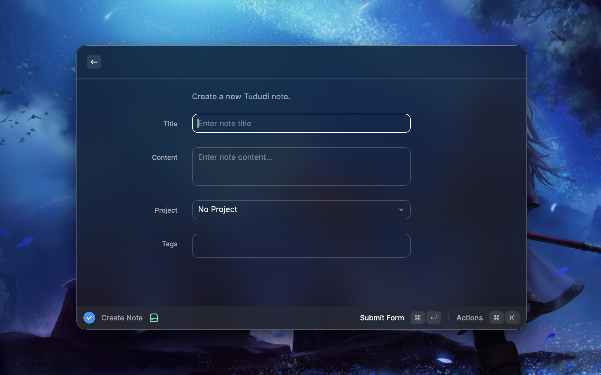

# Tududi

Manage [Tududi](https://github.com/chrisvel/tududi) tasks and notes from Raycast.

## Setup

1. Open your Tududi instance → **Settings → API Tokens** and create a token (`tt_...`).
2. In Raycast extension preferences:
   - **Tududi URL**: your instance root, e.g. `https://tududi.example.com` (no `/api` suffix needed)
   - **API Token**: paste the token

Compatible with Tududi **1.4+** (versioned `/api/v1`, status-based Today plan, Planned/Cancelled statuses).

## Commands

| Command | Description |
| --- | --- |
| **All Tasks** | Browse, filter, complete, and update tasks |
| **Today Tasks** | Tasks in today's plan (planned / in progress / waiting) |
| **Create Task** | Quick-add with project, tags, due date, and today plan |
| **All Notes** | Browse notes by project |
| **Create Note** | Compose a note with optional project and tags |

## Screenshots

Screenshot showing the available commands in the Tududi extension.

Screenshot showing the interface for creating a new task.

Screenshot demonstrating how to create a new note.
