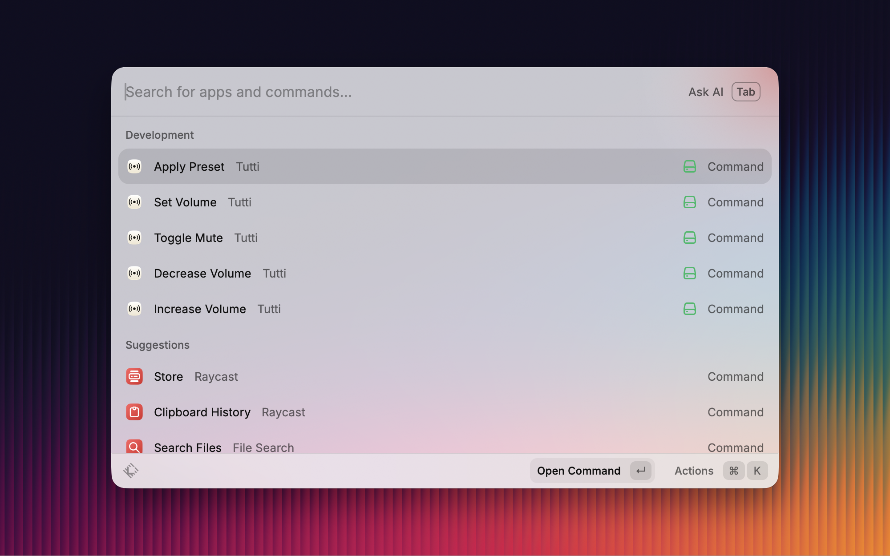

# Tutti for Raycast

Control [Tutti](https://tutti.barrybarrywu.com) — play the same audio through many
output devices at once on macOS — straight from the Raycast launcher.

  

  

## Commands

- **Apply Preset** — pick one of your saved presets and switch to it.
- **Toggle Mute** — mute or unmute your whole output.
- **Set Volume** — set the output volume to a percentage (0–100).
- **Increase Volume** / **Decrease Volume** — nudge every speaker together in fixed steps.

Assign a Raycast hotkey or alias to any command to fit your muscle memory.

## Requirements

1. **Tutti must be installed.** The extension drives Tutti through its `tutti://`
   URL scheme and reads your preset list from a small file Tutti keeps up to date.
   Get Tutti at <https://tutti.barrybarrywu.com>.
2. **These commands require Tutti Pro.** Automation is a Tutti Pro feature. Without
   Pro, triggering a command shows Tutti's own upgrade prompt, and the Apply Preset
   list is empty (presets are themselves a Pro feature).

## How it works

The extension bundles no binary and runs no background server. It **writes** by
opening `tutti://` action URLs, and **reads** your preset list from
`~/Library/Application Support/Tutti/presets.json`. The same actions work from any
terminal too, e.g. `open "tutti://mute"`.
