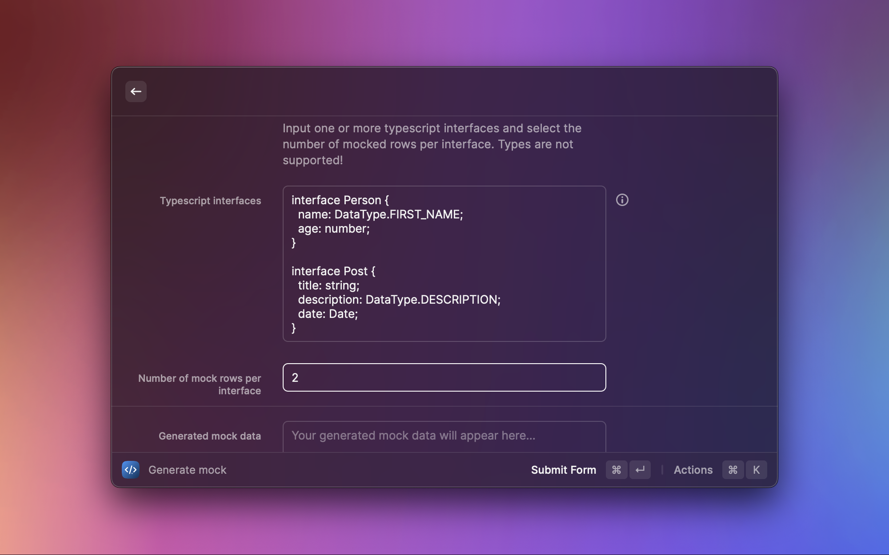
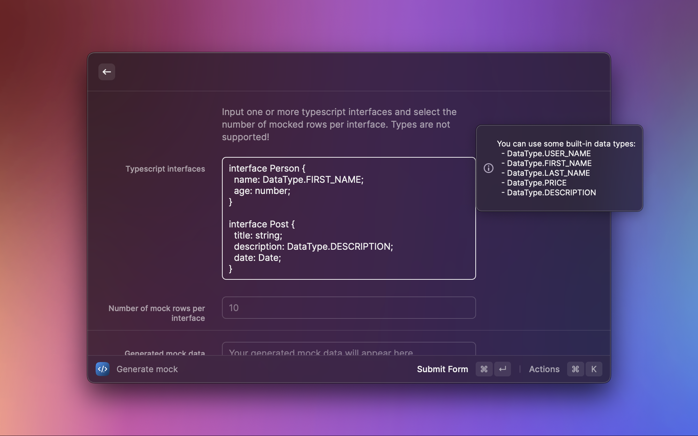
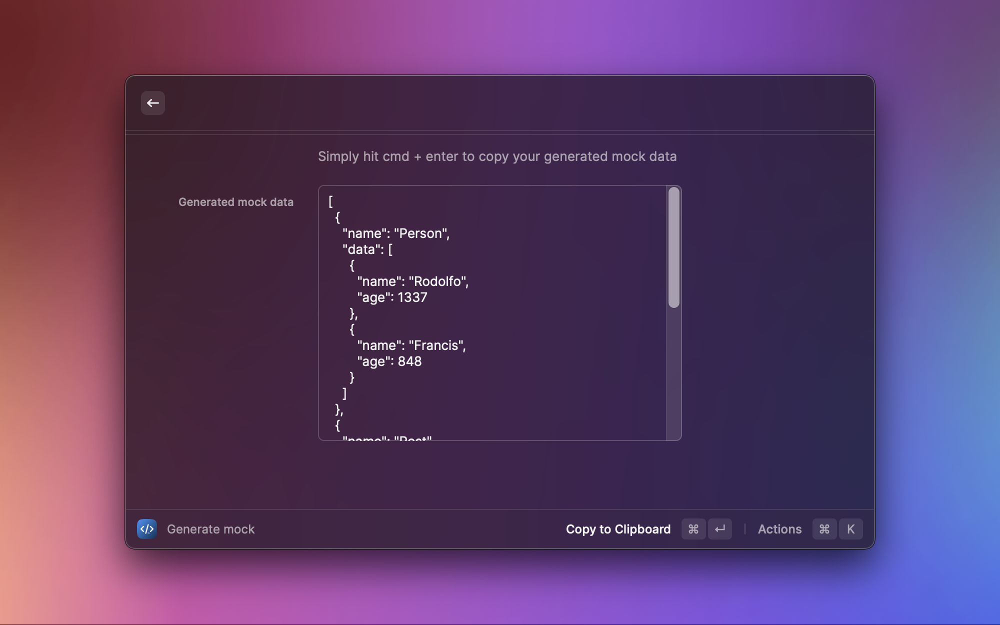
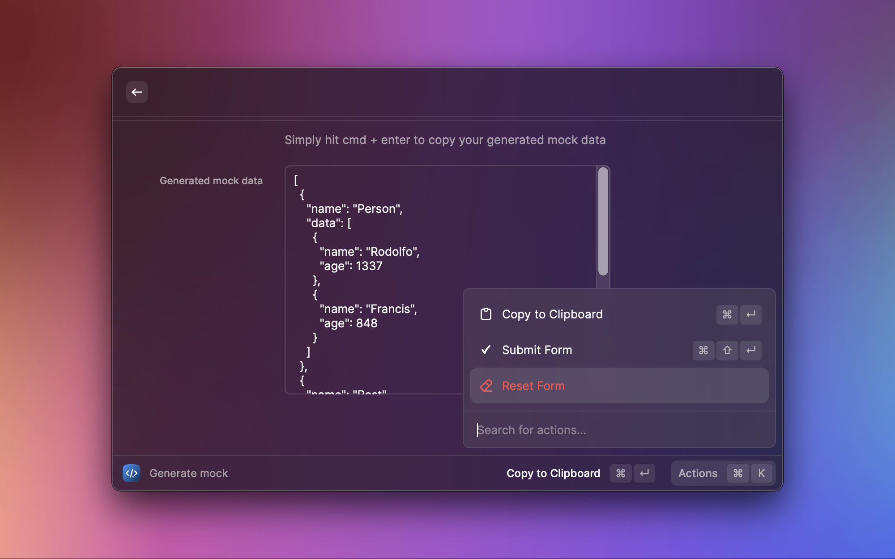

# Typescript Mock Generator

Generate mock/fake data from your typescript interfaces easily.

This extension is using the API from [ts-faker](https://github.com/SirwanAfifi/ts-faker) and currently does not add more on top of it.

## Example usage

### Input with 2 rows for each interface

```typescript
interface Person {
  name: DataType.FIRST_NAME;
  age: number;
}

interface Post {
  title: string;
  description: DataType.DESCRIPTION;
  date: Date;
}
```

### Output

```json
[
  {
    "name": "Person",
    "data": [
      {
        "name": "Isai",
        "age": 24
      },
      {
        "name": "Ricardo",
        "age": 78
      }
    ]
  },
  {
    "name": "Post",
    "data": [
      {
        "title": "praesentium tempore voluptatibus",
        "description": "Labore dicta quam aut est dolorem cupiditate accusamus.",
        "date": "2046-12-31T07:18:04.628Z"
      },
      {
        "title": "A minus tempore eos.\nIn optio atque non consectetur occaecati.\nEt eum id.\nUt amet asperiores veniam et distinctio ut nesciunt id.\nQuia voluptas libero.",
        "description": "Qui beatae ut enim ea animi.",
        "date": "2076-06-27T00:52:37.311Z"
      }
    ]
  }
]
```

## Screenshots





