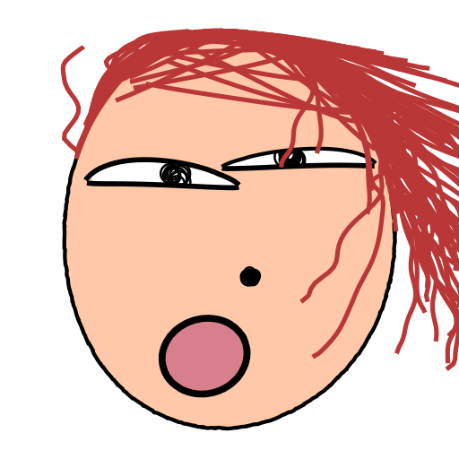

 
 

<h1 align="center">Ugly Face</h1>

Generate a random ugly face.

## Introduction

This extension build for [ugly-avatar](https://github.com/txstc55/ugly-avatar)

## Installation

Currently, you need to clone this repo and install it locally in developer mode.

You will need to have [Node.js](https://nodejs.org) and [pnpm](https://pnpm.io/) installed.

1. Clone this repo `git clone https://github.com/bxb100/ugly-face.git`
2. Go to the folder `cd ugly-face`
3. Install dependencies `npm install`
4. Go to Raycast, run `Import Extension` and select the folder

## Licenses

This project is under MIT License, but it uses some third-party libraries that have their own licenses:

### [resvg](https://github.com/RazrFalcon/resvg) 
**Mozilla Public License Version 2.0**

- `lib/resvg`
- `assets/index_bg.wasm`

### [ugly-avatar](https://github.com/txstc55/ugly-avatar)
**Attribution-NonCommercial 4.0 International**

- `lib/ugly-avatar`
