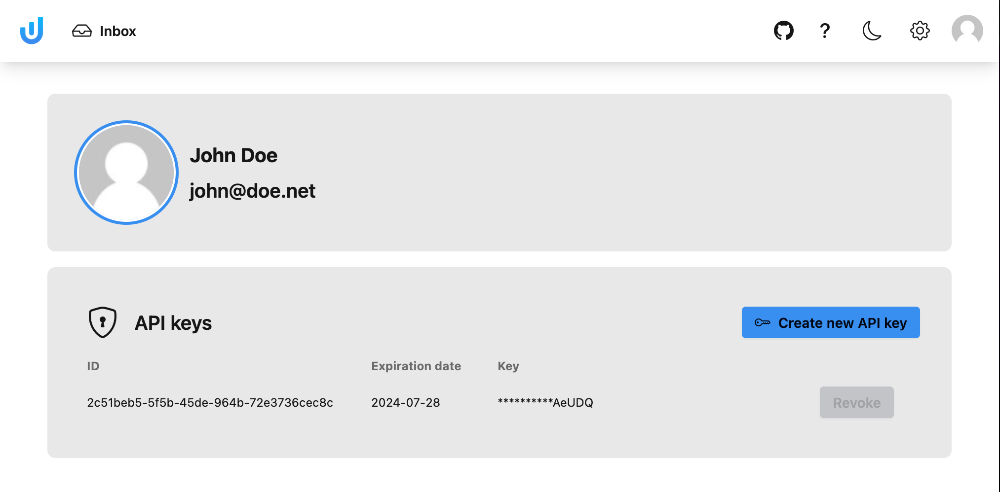

# Universal Inbox

Manage your notifications in a single [Universal Inbox](https://www.universal-inbox.com)

## Setup

To use the Universal Inbox extension for Raycast, you will need to configure an instance URL and an API key.

### Instance URL

The default instance URL is: https://app.universal-inbox.com
Get the URL from the Universal Inbox instance you are usually connecting to.

### API Key

You can get an API Key from your Universal Inbox user profile page:

