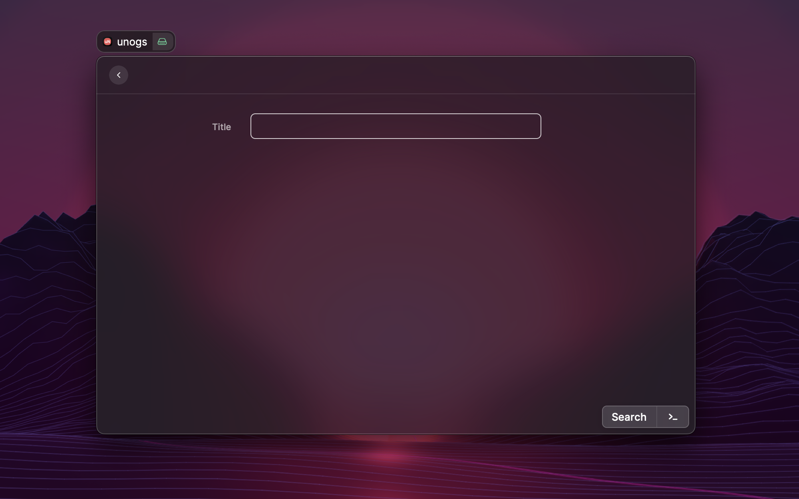
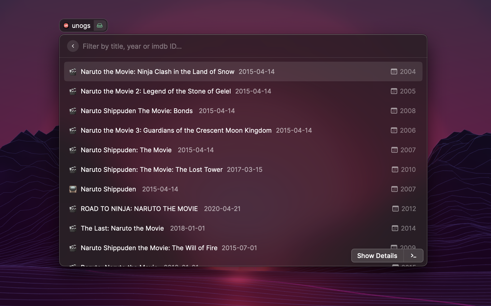
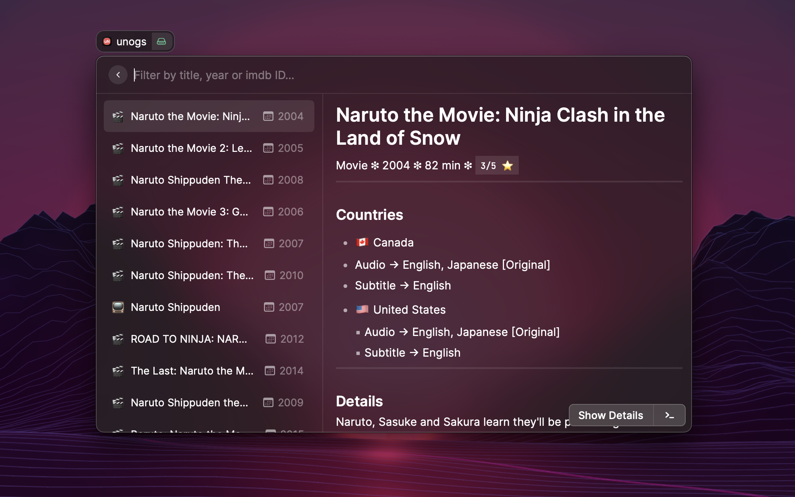

# Raycast Unogs
## Unofficial raycast extension for Unogs.
Search for netflix titles on [Unogs](https://unogs.com/). View the title's supported regions, audio and subtititle details.

## Installation and Setup
- Install the extenssion from Raycast store.
- Go to [RapidAPI](https://rapidapi.com/unogs/api/unogs/) page, and click on "Subscribe to test".
- You can select the free plan which gives you 100 free requests/day.
- Copy your API key and add it in the extension.

Note: You can still see the API key even without subscribing but it will not work in the extension.

## Usage
- Once you have added your API key, you can type a name of a Netflix movie or show and submit the first step.
- On next step you will see the results, you can filter through the search results with name, year and even imdb_id.
- You can open details by hitting enter.
- You can also select "Open in browser" from action to open it on Netflix.

## Demo

