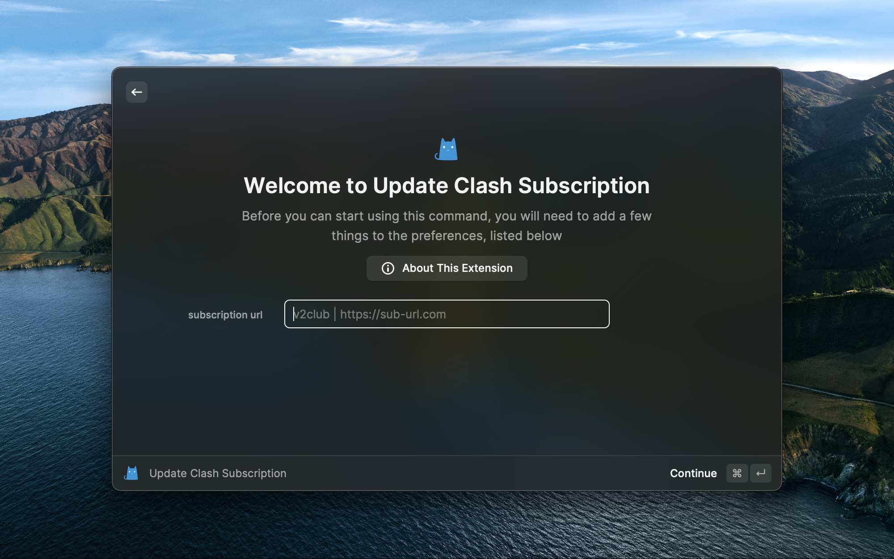
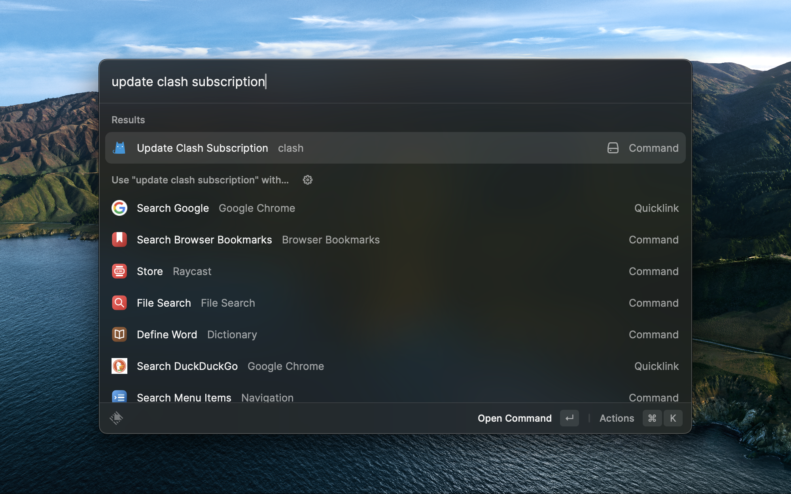

# Update Clash Subscription

> raycast extension to update clash subscription & insert custom rules

## Usage

This extension is not published to the store. So you need to clone this repo and run it locally.

```shell
git clone https://github.com/JakeLaoyu/update-clash-subscription.git
npm install
npm run dev
```

## Config

### Subscription Url

First, you need to convert a subscription url. You can use [this tool](https://sub.xeton.dev) to convert.

Other tools:
- https://sub.dler.io/
- https://sublink.dev/
- https://nexconvert.com/

Currently, only one address is supported.

Rule: [name] | [url].

Demo:

```
V2Club | https://sub.xeton.dev
```

### Rules

Please provide a json file.

Content Demo:

```json
{
  "rules": [
    "- DOMAIN-SUFFIX,npmjs.org,🚀 节点选择",
  ]
}
```



### Command

