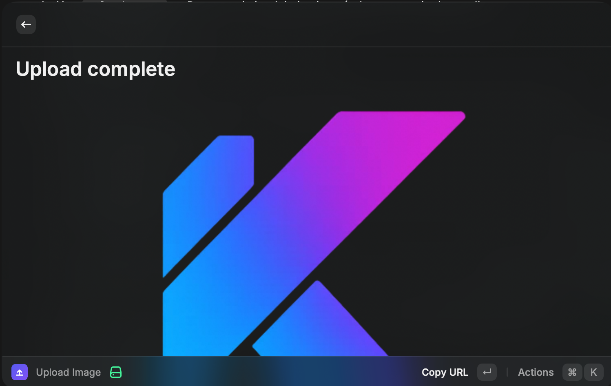

# UploadKit for Raycast

Upload an image to UploadKit without leaving Raycast. The extension uses UploadKit's secure presigned upload flow and automatically copies the resulting CDN URL.



## Setup

1. Open the [UploadKit dashboard](https://app.uploadkit.dev).
2. Select a project and open **Settings → API Keys**.
3. Create a live API key and copy it.
4. Open **Raycast Settings → Extensions → UploadKit** and paste the key into **UploadKit API Key**.

The key is stored as a Raycast password preference and is only sent to `api.uploadkit.dev`. File bytes upload directly to the presigned storage URL; the API key is never sent to storage.

## Use

1. Run **Upload Image** in Raycast.
2. Choose a PNG, JPEG, GIF, WebP, AVIF, SVG, HEIC, BMP, or TIFF image.
3. Press `⌘` `↵`.

When the upload completes, the CDN URL is copied to the clipboard. The result screen also lets you copy the URL again or open the image in your browser.

## Development

```bash
npm install
npm run dev
```

Validation:

```bash
npm run typecheck
npm run lint
npm run build
```
