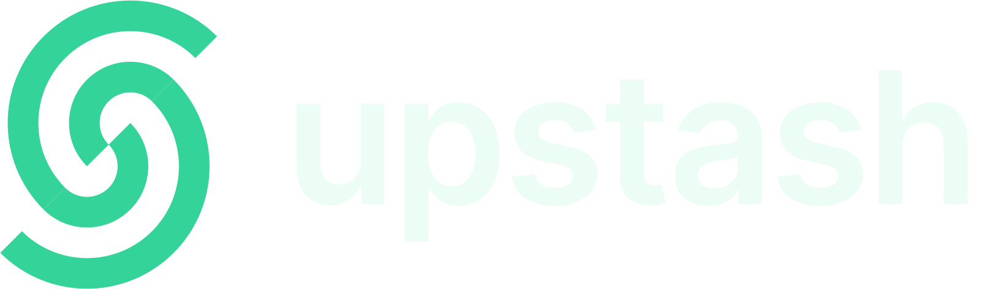

# Upstash

This is a Raycast extension for [Upstash](https://upstash.com/) - _Serverless Data Platform_.

## 🚀 Getting Started

1. **Install extension**: Click the `Install Extension` button in the top right of [this page](https://www.raycast.com/xmok/upstash) OR `install` via Raycast Store

2. **Get your Upstash Email Address**: this will be the one you use to `login`

3. **Get your Upstash API Key**:

    - `Follow` instructions from [Getting Started - Upstash Documentation](https://upstash.com/docs/devops/developer-api/introduction)
    - `Copy` the key and `Paste` it in **Preferences** OR when prompted

## 🔧 Features

###  Redis

- List Redis Databases
    - View Details & Usage
    - Create Database

###  Vector

- List Vector Indices
    - Create Index
    - Delete Index

## ➕ MORE

Looking for another DB solution? Try these:

---

