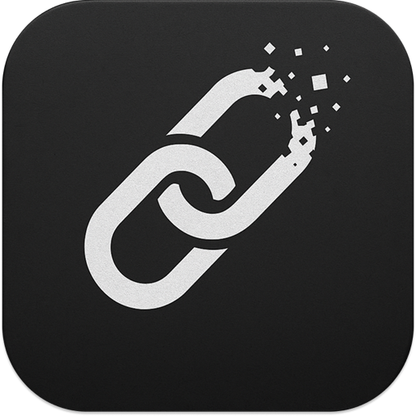

# Vanishlink

<p align="center">
   
</p>

一時的に必要なリンクを素早く管理するためのRaycast Extension

## 概要

VanishLinkは、短期間だけ必要なリンクを効率的に管理するためのRaycast Extensionです。Bookmarkするほどでもないけれど、ショートカットでアクセスしたいリンクを簡単に追加・管理できます。

## 特徴

- **クリップボードからワンクリック追加**: URLをクリップボードにコピーするだけで、簡単にリンクを追加
- **自動タイトル取得**: WebページのタイトルをMeta情報から自動取得
- **高速検索**: URLやタイトルで素早く検索可能
- **設定可能な自動期限切れ**: 設定可能な期間（1日～1年、デフォルト：2週間）アクセスのないリンクは自動削除
- **直感的な操作**: Raycastの標準的なUIで一貫した操作体験

## コマンド

### Add from Clipboard

クリップボードのURLをブックマークに追加します。

- クリップボードにURLをコピー
- `add-from-clipboard`を実行
- Webページのタイトルが自動取得され、ブックマークに追加

### Add Bookmark

フォームでURLとタイトルを入力してブックマークを追加します。

- `add`を実行
- フォームでURLとタイトルを入力
- URLを入力するとタイトルが自動取得される（編集可能）
- 送信してブックマークを保存

### Open

保存されたリンクを検索・管理します。

- `search`を実行
- リンクを検索（タイトルまたはURL）
- Enterキーでリンクを開く
- アクションパネルから削除も可能

## 使用方法

1. **クリップボードからリンクの追加**
   - 追加したいWebページのURLをクリップボードにコピー
   - Raycastを開いて`vanishlink add-from-clipboard`を実行
   - 自動的にタイトルが取得され、ブックマークに追加されます

2. **手動でリンクの追加**
   - Raycastを開いて`vanishlink add`を実行
   - フォームでURLとタイトルを入力
   - URLを入力するとタイトルが自動取得される（編集可能）
   - 送信してブックマークを保存

3. **リンクの検索・開く**
   - Raycastを開いて`vanishlink search`を実行
   - 検索バーでリンクを検索
   - Enterキーでリンクを開く（最終アクセス日時が更新されます）

4. **リンクの削除**
   - `vanishlink search`でリンクを選択
   - アクションパネル（`Cmd + K`）から「リンクを削除」を選択

## 技術仕様

- **対応プラットフォーム**: macOS
- **依存関係**:
  - @raycast/api
  - @raycast/utils
  - node-html-parser
- **ストレージ**: Raycast LocalStorage
- **自動削除**: 設定可能な期間（1日～1年、デフォルト：2週間）未アクセスのリンクは自動削除

## ファイル構成

```
src/
├── add-from-clipboard.ts  # クリップボードからの追加コマンド
├── add.tsx               # フォーム形式の追加コマンド
├── search.tsx            # リンク表示・管理コマンド
└── lib/
    ├── bookmark-delete.ts # ブックマーク削除機能
    ├── bookmark-get.ts   # ブックマーク取得機能
    ├── bookmark-save.ts  # ブックマーク保存機能
    ├── fetch-page-title.ts # ページタイトル取得
    ├── is-expired.ts     # 期限切れ判定
    ├── types.ts          # 型定義
    └── utils.ts          # ユーティリティ関数
```

## ライセンス

MIT License

## 作者

n_seiji
