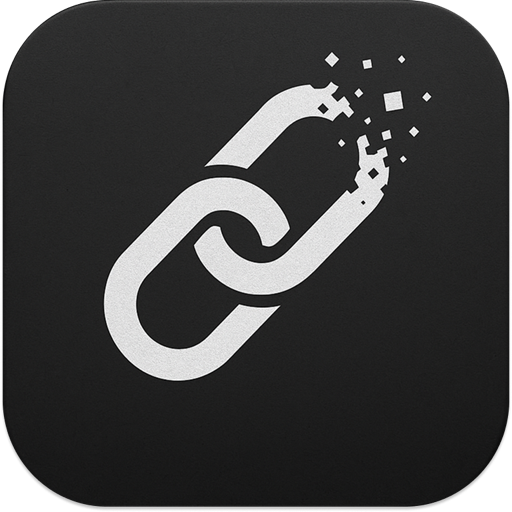

# vanishlink

<p align="center">
   
</p>

A Raycast Extension for efficiently managing temporary links that vanish after inactivity

[日本語](README.ja.md)

## Overview

VanishLink is a Raycast Extension designed to efficiently manage links that you need for short periods. It allows you to easily add and manage links that don't warrant permanent bookmarks but require quick access through shortcuts.

## Features

- **One-click addition from clipboard**: Simply copy a URL to clipboard and add it instantly
- **Form-based manual addition**: Add links with custom titles using a user-friendly form
- **Automatic title fetching**: Automatically retrieves page titles from meta information
- **Fast search**: Quickly search by URL or title
- **Configurable auto-expiration**: Links not accessed for a configurable period (1 day to 1 year, default: 2 weeks) are automatically deleted
- **Intuitive operation**: Consistent user experience with Raycast's standard UI

## Commands

### Add from Clipboard

Adds a link from clipboard to bookmarks.

- Copy URL to clipboard
- Run `vanishlink add-from-clipboard`
- Page title is automatically fetched and bookmark is added

### Add Bookmark

Add links with custom titles using a form interface.

- Run `vanishlink add`
- Enter URL and title in the form
- URL automatically fetches page title (editable)
- Submit to save bookmark

### Search Links

Search and manage saved links with editing capabilities.

- Run `vanishlink search`
- Search links by title or URL
- Press Enter to open link (updates last access time)
- Edit bookmarks via action panel (URL and title)
- Delete links via action panel
- Add new bookmarks directly from empty state

## Usage

1. **Adding links from clipboard**
   - Copy the URL of the webpage you want to add
   - Open Raycast and run `vanishlink add-from-clipboard`
   - Title is automatically fetched and bookmark is added

2. **Adding links manually**
   - Open Raycast and run `vanishlink add`
   - Enter URL and title in the form
   - URL automatically fetches page title (can be edited)
   - Submit to save bookmark

3. **Searching and opening links**
   - Open Raycast and run `vanishlink search`
   - Search for links using the search bar
   - Press Enter to open link (last access time is updated)

4. **Editing links**
   - Select a link in `vanishlink search`
   - Use action panel (`Cmd + K`) to select "Edit Bookmark"
   - Modify URL or title and submit

5. **Deleting links**
   - Select a link in `vanishlink search`
   - Use action panel (`Cmd + K`) to select "Delete Link"

## Technical Specifications

- **Supported Platform**: macOS
- **Dependencies**:
  - @raycast/api
  - @raycast/utils
  - node-html-parser
- **Storage**: Raycast LocalStorage
- **Auto-deletion**: Links not accessed for a configurable period (1 day to 1 year, default: 2 weeks) are automatically deleted

## File Structure

```
src/
├── add-from-clipboard.ts  # Add from clipboard command
├── add.tsx               # Form-based add command
├── search.tsx            # Link search, display and management command
└── lib/
    ├── bookmark-delete.ts # Bookmark deletion functionality
    ├── bookmark-get.ts   # Bookmark retrieval functionality
    ├── bookmark-save.ts  # Bookmark saving functionality
    ├── constants.ts      # Time constants and expiry configuration
    ├── fetch-page-title.ts # Page title fetching
    ├── is-expired.ts     # Expiration checking
    ├── time-format.ts    # Time formatting utilities
    ├── types.ts          # Type definitions
    └── utils.ts          # Utility functions
```

## License

MIT License

## Author

n_seiji
