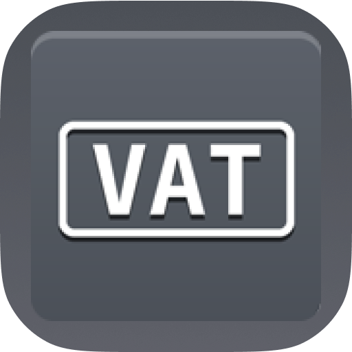

#  vatlayer Raycast Extension

This is a Raycast extension for [vatlayer](https://vatlayer.com/). With this extension you can Validate VAT numbers, retrieve all or single EU VAT rates based on IP address or country code, convert prices in compliance with EU VAT rates and types, and more, using vatlayer API.

## 🚀 Getting Started

1. **Install extensions**: Click the `Install Extension` button in the top right of [this page](https://www.raycast.com/xmok/vatlayer)

2. **Get your Access Key**: The first time you use the extension, you'll need to enter your vatlayer API access key:

    a. `Sign in to your vatlayer Dashboard` at [this link](https://vatlayer.com/login) OR `Create an account` at [this link](https://vatlayer.com/product)

    b. `Navigate` to [Dashboard](https://vatlayer.com/dashboard)

    c. `Copy` API Access Key

    d. Enter `Access Key` in Preferences OR at first prompt

## ⚙️ Preferences
- By default, the extension will use unsecured "http" link for API. You can switch to using more secure "https" link in the Preferences (NOTE: this requires a Paid plan).

- If you try to get/calculate VAT using a non-EU country, the VAT will be returned as a ZERO (0) instead of an error.

## 🔧 Command

This extension provides the following single command:

- Validate VAT Number
- Get VAT Rates via Country Code
- Get VAT Rates via IP Address
- Get VAT Rates via Client IP
- Get VAT Rates for all EU Members
- Calculate VAT Compliant Price