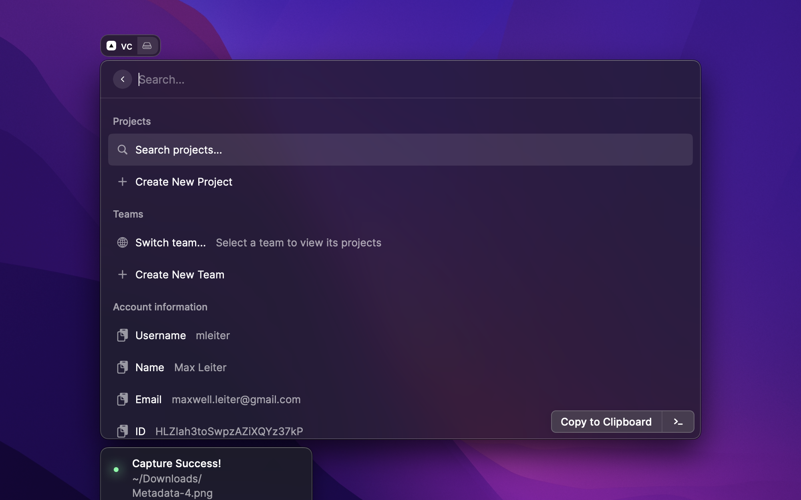
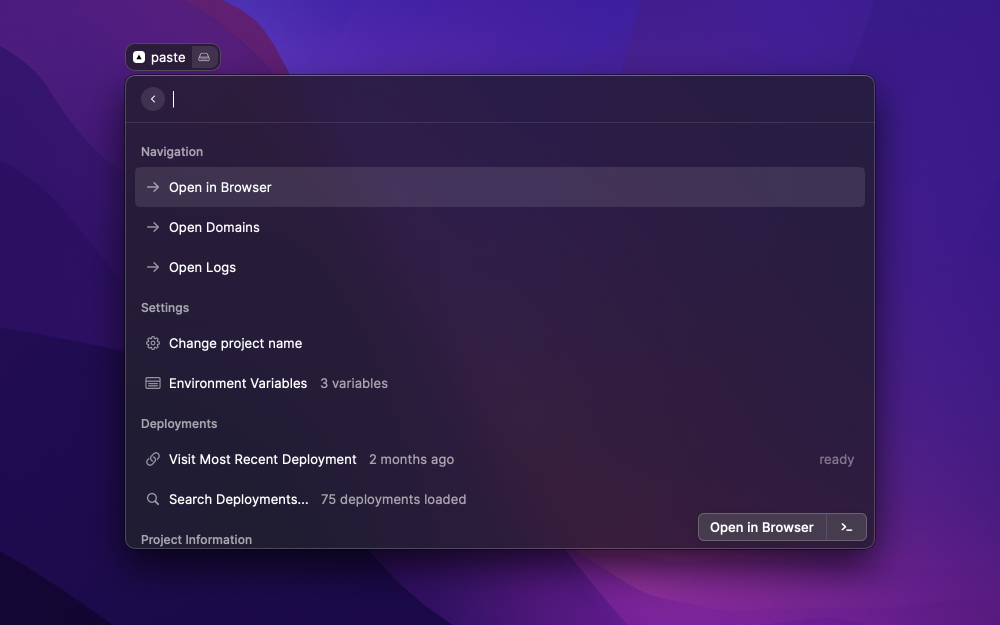
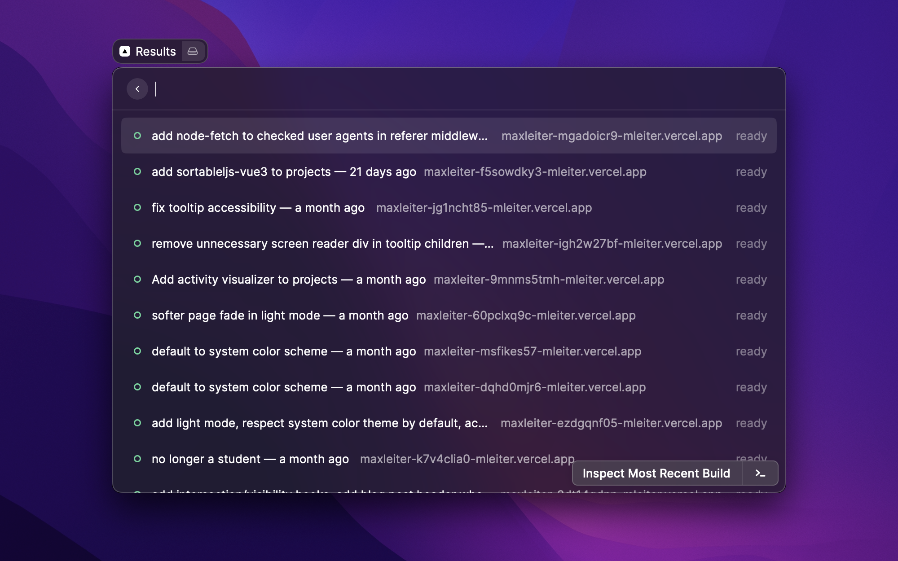
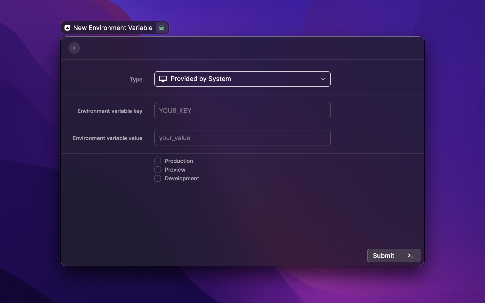

# Vercel Project Explorer
Vercel for Raycast.

## Setup:
- You need to add your Vercel token in the extension settings. You can get it from https://vercel.com/account/tokens.

## Current features:
- View and search projects (by team or user)
- View and search deployments
- Edit, add, and delete environment variables
- Inspect deployment files

## Roadmap (in no particular order):
- Recents list
- Ability to ping and see logs for serverless functions 

## Contributing
The [Vercel REST API docs](https://vercel.com/docs/rest-api) and [Raycast developer docs](https://developers.raycast.com/) are good places to start. Feel free to open an issue or [ping me on Twitter](https://twitter.com/max_leiter) if you want to help out.

This is a (heavily) modified fork of the [vercast](https://github.com/raycast/extensions/tree/main/extensions/vercast) extension.

## Screenshots:

