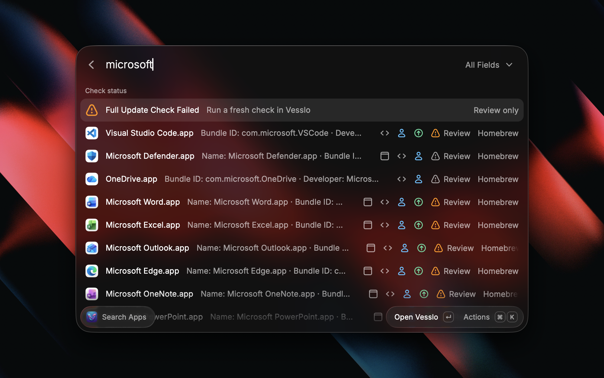

# Vesslo

<p align="center">
  
</p>

Search your Vesslo app library, review updates and findings, and follow Homebrew requests from Raycast.

[Website](https://vesslo.top/vesslo) · [Vesslo for macOS](https://github.com/hjm79/Vesslo-MacAppManager) · [Raycast Store](https://www.raycast.com/hjm79/vesslo)

> **Requires Vesslo 2.1.0 (Build 30) or later on macOS 13 or later.** [Download Vesslo 2.1.0](https://github.com/hjm79/Vesslo-MacAppManager-release/releases/download/v2.1.0/Vesslo.dmg). Vesslo provides a 14-day trial; a license is required after the trial.

## Setup

1. Use macOS 13 or later with Raycast and [Vesslo 2.1.0 (Build 30) or later](https://github.com/hjm79/Vesslo-MacAppManager-release/releases/download/v2.1.0/Vesslo.dmg) installed. Vesslo is a separate paid companion app with a 14-day trial. No additional account, API key, or credential preference is required by this extension.
2. Open Vesslo and let it load your app library. Vesslo automatically exports the library to `~/Library/Application Support/Vesslo/raycast_data.json`.
3. Run the desired Vesslo command in Raycast. **Reload Vesslo Data (`⌘R`)** rereads the local export. To check for newer app versions, run an update check in Vesslo itself.
4. For exact Homebrew review, run an update check in Vesslo before selecting targets in Raycast. Vesslo 2.1.0 (Build 30) provides the required review and receipt integration; each selected target must still have current readiness evidence.

## Commands

| Command | What it does |
| --- | --- |
| **Search Apps** | Find apps by name, Bundle ID, developer, tag, or memo. Choose a search field, read match context, and open an available app, reveal it in Finder, or inspect it in Vesslo. |
| **View Updates** | Inspect Vesslo's exported candidates, current and target versions, source filters, sorting, and check status. Use `⌘I` for details. Supported actions open Vesslo or the App Store as indicated. |
| **Bulk Homebrew Update** | Select 1–16 eligible Homebrew app installations, review the selection, and ask Vesslo to confirm it. Selection survives search changes. Vesslo owns execution and verification. |
| **Browse by Tag** | Browse installed apps under their exact Vesslo tags. Back navigation preserves the previous view. |
| **Review Apps** | Inspect exported Security, Update Sources, or Management findings. Switch **All Apps / Update Candidates** independently with `⌘⇧U`; use `⌘I` for details. This view does not scan or update apps. |
| **Deleted Apps** | Search deleted records retained in the export and copy their recorded Bundle IDs or paths. It does not restore, reinstall, open, or update deleted apps. |
| **Homebrew Requests** | Read Vesslo's request history and results for every original target. Inspect technical details when needed. The command cannot retry, delete, or execute requests. |

Tags and memos are edited in Vesslo. The extension presents the data Vesslo has exported.



*Actual local candidate UI. Library contents and check status depend on your Vesslo export.*

## Review a Homebrew update

1. Run an update check in a compatible Vesslo companion.
2. In **Bulk Homebrew Update**, select the eligible apps you want to update. Individual Homebrew actions use the same review flow.
3. Inspect the selected apps and open their review in Vesslo.
4. Confirm the apps and versions in Vesslo. Updating starts only after that confirmation.
5. Follow progress in **Homebrew Requests**. Cancelling the native review records a cancellation for the same request.

The extension rechecks the selected installations, versions, and readiness immediately before handoff. A changed target or expired readiness requires refreshed data and another review. Manual-installer candidates require review in Vesslo instead of joining the Homebrew selection.

The extension does not run Homebrew, `mas`, or Terminal directly. Sending a request or opening Vesslo does not establish that an update completed.

| Status | Meaning |
| --- | --- |
| **Review only** | The data can be inspected, but it does not currently authorize the update action. Follow the displayed instruction to refresh or review it in Vesslo. |
| **Verification Pending** | Vesslo still needs to verify the result. This is not completion. |
| **Completed** | Vesslo verified every original target for that recorded request. This historical result is not a new check of the currently installed version. |
| **Rejected / Failed / Cancelled** | Inspect the recorded reason and target results. These states do not imply a successful update. |

An unrelated source failure remains visible even when selected Homebrew targets have valid readiness. Earlier-session and expired results remain identified as history.

## Local data and access

The extension reads Vesslo's local export and `~/Library/Application Support/Vesslo/raycast_receipts.json`. It does not run its own inventory scan, update check, or security scan. Missing, unreadable, stale, or incompatible data is reported in the UI and limits the available actions; an absent receipt does not mean a request was accepted.

App names, paths, tags, memos, and request details may appear in Raycast. The extension has no HTTP client or analytics. Actions can open apps, Finder, Vesslo, or the App Store and copy displayed values. Those apps and services have their own network and permission behavior. System permissions and update execution are handled by Vesslo.

## Development

Use Node.js 22.22.2 or later and the committed npm lockfile:

```sh
npm ci --no-audit --no-fund
npm run typecheck
npm run lint:source
npm test
npm run lint
npm run build:check
```

`npm run dev` starts Raycast development mode. `npm run publish` submits a Store contribution; it is not a local build command.

## License

MIT
