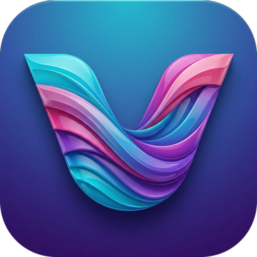

# Vesslo

  
  <h1 align="center">Vesslo</h1>

🌐 **Website**: [https://vesslo.top](https://vesslo.top)
📦 **GitHub**: [https://github.com/hjm79/Vesslo-MacAppManager](https://github.com/hjm79/Vesslo-MacAppManager)

Search and manage your Vesslo app library directly from Raycast.

## Features

- 🔍 **Search Apps** - Find apps by name, developer, tag, or memo
- 🔄 **View Updates** - Check for pending updates (Homebrew, Sparkle, App Store, Manual)
- 🍺 **Bulk Update** - Update all Homebrew cask apps at once
- 🏷️ **Browse by Tag** - Explore apps organized by your tags
- 🔗 **Deep Integration** - Open in Vesslo, Finder, or launch directly

## Requirements

- **Vesslo Application**: Must be installed on your Mac
- **Data Export**: Extension reads from `~/Library/Application Support/Vesslo/raycast_data.json` (auto-generated by Vesslo)

## Commands

### 🔍 Search Apps
Quickly find apps in your Vesslo library with flexible filtering options.
- **Filter**: Name, Developer, Tag, Memo
- **Visuals**: Icons indicate matched fields

### 🔄 View Updates
Check all available updates across different sources with Vesslo integration.
- **Sources**: Homebrew, Sparkle, App Store, Manual
- **Source Priority** (grouped view): Homebrew > Sparkle > App Store > Manual
- **Actions**: Update via Vesslo Deep Link (Recommended), Direct execution, or Terminal

| Action | Shortcut |
|--------|----------|
| Homebrew Quick Update | `⌘⇧↩` |
| Homebrew Update via Terminal | `⌘⇧T` |
| Open in App Store | `⌘⇧O` |
| App Store Update via Terminal (mas) | `⌘⇧M` |

### 🏷️ Browse by Tag
Organize and explore your app collection by custom tags.

### 🍺 Bulk Homebrew Update
Update all Homebrew cask applications safely using Vesslo's batch update workflow.
- **Default**: Triggers `vesslo://update-all` for a unified update experience
- **Alternatives**: Direct Raycast execution or Terminal mode available via Action Panel

## License

MIT
