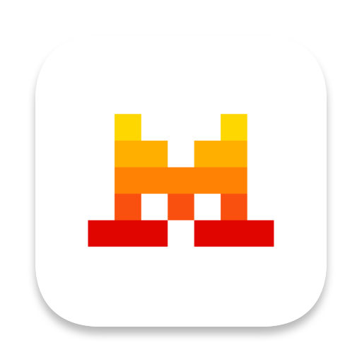

# Vibe Here

<div align="center">



**Open Mistral Vibe in Warp, Ghostty or Terminal in the selected folder.**

[](https://www.raycast.com/)
[](https://opensource.org/licenses/MIT)
[](https://github.com/mistralai/mistral-vibe)

</div>

---

## ✨ Features

- **Quick Access**: Open Warp, Ghostty or Terminal directly in the selected Finder folder with a single command
- **Automatic Vibe Launch**: The `vibe` CLI starts automatically in the new terminal tab/window
- **Smart Folder Detection**: Works with:
  - Selected file/folder in Finder
  - Frontmost Finder window
- **Customizable**: Choose your preferred terminal (Warp, Ghostty or Terminal) and configure the `vibe` binary path
- **Seamless Integration**: Launches your terminal with Vibe supercharged AI assistance

---

## 🚀 Installation

### From Raycast Store

1. Open Raycast
2. Go to **Extensions** → **Search**
3. Search for **"Vibe Here"**
4. Click **Install**

[→ View on Raycast](https://www.raycast.com/extensions/vibe-here)

### Manual Installation

1. Clone this repository:
   ```bash
   git clone https://github.com/sierakk/vibe-here.git
   ```
2. Open Raycast
3. Go to **Extensions** → **Import Extension**
4. Select the cloned folder

---

## 🛠️ Requirements

- [Raycast](https://www.raycast.com/) (macOS)
- [Mistral Vibe CLI](https://github.com/mistralai/mistral-vibe) installed
- One of the supported terminals:
  - [Warp](https://www.warp.dev/) (default)
  - [Ghostty](https://ghostty.sh/)
  - Terminal (built-in, preinstalled on every macOS)

### Install Mistral Vibe

```bash
# Using Homebrew (recommended)
brew install mistral-vibe

# Or using pip
pip install mistral-vibe

# Or from source
curl -sSL https://github.com/mistralai/mistral-vibe/raw/main/install.sh | bash
```

---

## 🎛️ Configuration

After installing the extension, you can configure it in Raycast:

1. Open Raycast Preferences (`⌘,`)
2. Navigate to **Vibe Here** extension
3. Configure the following options:

| Option | Description | Default |
|--------|-------------|---------|
| **Terminal** | Choose between Warp, Ghostty or Terminal | `warp` |
| **Vibe Binary** | Path to the vibe CLI executable | `/opt/homebrew/bin/vibe` |

---

## 💡 Usage

### Basic Usage

1. **Select a folder** in Finder (or a file — the extension will use its parent directory)
2. Open Raycast (`⌥⌘␣` by default)
3. Search for **"Vibe Here"**
4. Press Enter

If nothing is selected, the front Finder window is used.

The selected terminal will open in that folder, with `vibe` ready to go.

### Example Workflow

```
# In Finder:
1. Navigate to your project folder
2. Select the folder (or any file within it)
3. Run "Vibe Here" from Raycast

# Result:
Warp/Ghostty/Terminal opens with:
  cd /path/to/your/project
  vibe
```

---

## 🔧 How It Works

Vibe Here uses a combination of Raycast APIs and AppleScript to:

1. **Detect the target folder** from Finder selection or frontmost window
2. **Open your terminal** (Warp, Ghostty or Terminal) at that location
3. **Type and execute** the `vibe` command automatically

For Warp, it uses deep links (`warp://action/new_tab`) and simulates typing.
For Ghostty, it uses either the CLI or AppleScript to open a new window.
For Terminal, it uses AppleScript `do script` to open a new window and run the command directly.

---

## 🌟 Why Vibe Here?

Mistral Vibe is an AI coding assistant that understands your codebase. With Vibe Here:

- **Instant context**: Start coding with AI assistance in any project folder
- **No manual setup**: Just select and go — no need to `cd` and `vibe` manually
- **Perfect for**: Quick edits, debugging, exploring codebases with AI help

This extension bridges the gap between your file browser and AI-powered development.

---

## 📚 Related Projects

- [Mistral Vibe CLI](https://github.com/mistralai/mistral-vibe) — The official Mistral Vibe command-line interface
- [Raycast](https://www.raycast.com/) — The productivity tool that powers this extension
- [Warp](https://www.warp.dev/) — Modern terminal emulator for macOS
- [Ghostty](https://ghostty.sh/) — Fast, modern, GPU-accelerated terminal
- [Terminal](https://support.apple.com/guide/terminal/welcome/mac) — The built-in macOS terminal

---

## 🤝 Contributing

Contributions are welcome! Feel free to:

- Report bugs or suggest features via [GitHub Issues](https://github.com/sierakk/vibe-here/issues)
- Submit pull requests with improvements
- Share your feedback and ideas

---

## 📜 License

This project is licensed under the MIT License - see the [LICENSE](LICENSE) file for details.

---

<div align="center">

**Made with ❤️ for the developer community**

[Mistral AI](https://mistral.ai/) | [Raycast](https://www.raycast.com/)

</div>
